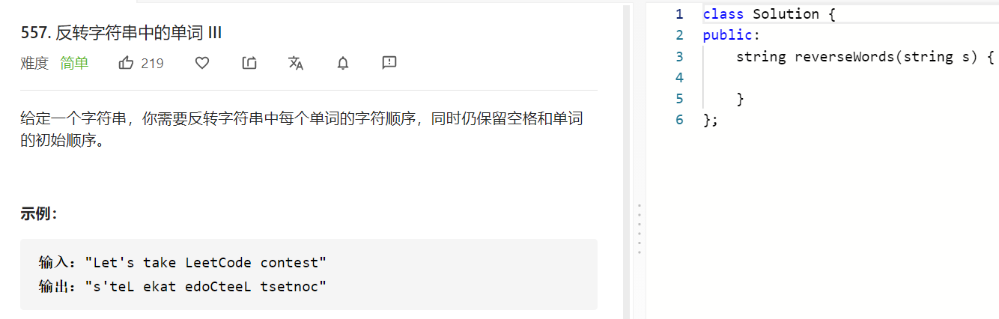

### 题目要求



### 解题思路

直接手撸。

### 本题代码

```c++
class Solution {
public:
    string reverseWords(string s) {
        if(s.size() == 0)
            return s;
        int i = 0;
        while(i < s.size() && s[i] == ' ')
            i++;
        string temp = "";
        string res = "";
        while(i < s.size()){
            if(s[i] == ' '){
                if(temp != ""){
                    reverse(temp.begin(), temp.end());
                    res += temp;
                    res += ' ';
                    temp = "";
                }
            }
            else
                temp += s[i];
            i++;
        }
        if(temp != ""){
            reverse(temp.begin(), temp.end());
            res += temp;
        }
        return res.substr(0, res.size());
    }
};
```

### [手撸测试](https://leetcode-cn.com/problems/reverse-words-in-a-string-iii/)  

