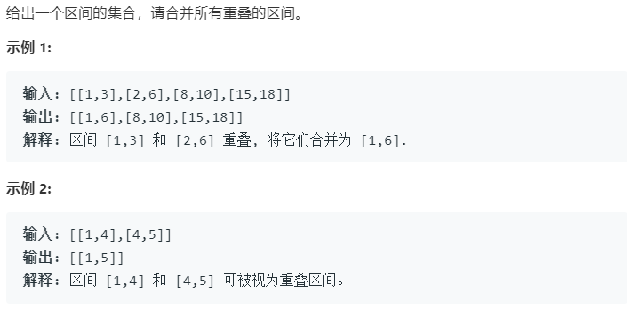

### 题目要求



### 解题思路

straightforward的思路，首先对`intervals`的元素进行排序，然后按照合并区间的规律来合并更新结果。

### 本题代码

```c++
class Solution {
public:
    vector<vector<int>> merge(vector<vector<int>>& intervals) {
        if(intervals.size() == 0 || intervals[0].size() < 2)
            return vector<vector<int>>();
        vector<vector<int>>res;
        sort(intervals.begin(), intervals.end());
        for(auto vec : intervals){
            if(res.empty() || res.back()[1] < vec[0])
                res.push_back(vec);
            else{
                res.back()[1] = res.back()[1] > vec[1] ? res.back()[1] : vec[1];
            }
        }
        return res;
    }
};
```

### [手撸测试](<https://leetcode-cn.com/problems/merge-intervals/>) 

