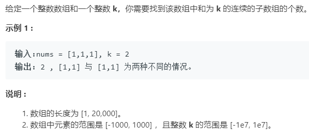

### 题目要求



### 解题思路

前缀和方法，构建`sum`数组，`sum[i]`表示的是前`i`项的和。核心公式就是判断$$s[j]-s[i] == k$$。如果要把时间复杂降到$$O(n)$$需要哈希数组的配合，思路就和两数之和一样，具体看代码。

### 本题代码

不带哈希的解法

```c++
class Solution {
public:
    int subarraySum(vector<int>& nums, int k) {
        if(nums.size() == 0)
            return 0;
        int sum[nums.size() + 1] = {0};
        sum[0] = 0;
        for(int i = 1;i <= nums.size();i++){
            sum[i] = sum[i - 1] + nums[i - 1];
        }
        int count = 0;
        for(int i = 0;i <= nums.size();i++){
            for(int j = i + 1;j <= nums.size();j++){
                if(sum[j] - sum[i] == k)
                    count++;
            }
        }
        return count;
    }
};
```

带哈希的解法

```c++
class Solution {
public:
    int subarraySum(vector<int>& nums, int k) {
        if(nums.size() == 0)
            return 0;
        int res = 0;
        unordered_map<int, int>m;
        int cur = 0;
        m[0] = 1;//前缀和刚好为k
        for(auto num : nums){
            cur += num;
            res += m.find(cur - k) == m.end() ? 0 : m[cur - k];
            m[cur]++;
        }
        return res;
    }
};
```

### [手撸测试](<https://leetcode-cn.com/problems/subarray-sum-equals-k/>) 
