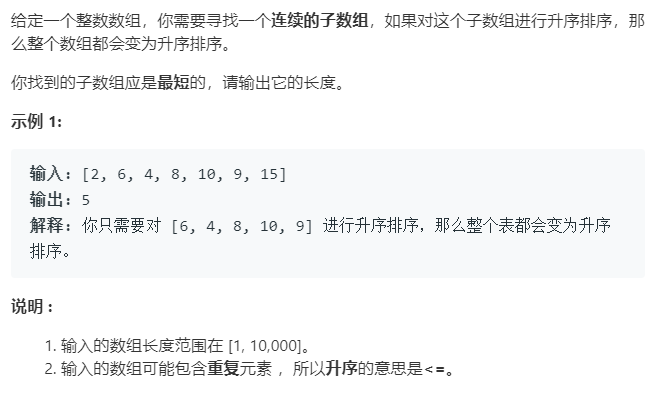

### 题目要求



### 解题思路

两边遍历的方法。首先从右往左，不停更新记录最小值以及需要排序尽可能远的位置(如果是升序排列的那么从右往左一定都是降序的，只要大于最小值那么就是该处需要排序的)；接着从左往右走，不停记录最大值以及需要排序尽可能远的位置(同最小值，如果是升序的从左走只要小于最大值就是需要排序的位值)。

### 本题代码

```c++
class Solution {
public:
    int findUnsortedSubarray(vector<int>& nums) {
        if(nums.size() == 0 || nums.size() < 2)
            return 0;
        int noMinIndex = -1;
        int minN = nums[nums.size() - 1];
        for(int i = nums.size() - 1;i >= 0;i--){
            if(nums[i] > minN) // 大于最小值说明不是从右往左的降序
                noMinIndex = i;
            else
                minN = min(minN, nums[i]);
        }
        if(noMinIndex == -1) // 如果没找到说明全是升序
            return 0;
        int noMaxIndex = -1;
        int maxN = nums[0];
        for(int i = 0;i < nums.size();i++){
            if(nums[i] < maxN) // 小于最大值说明不是从左往右的升序
                noMaxIndex = i;
            else
                maxN = max(maxN, nums[i]);
        }
        return noMaxIndex - noMinIndex + 1;
    }
};
```

### [手撸测试](<https://leetcode-cn.com/problems/shortest-unsorted-continuous-subarray/>) 

