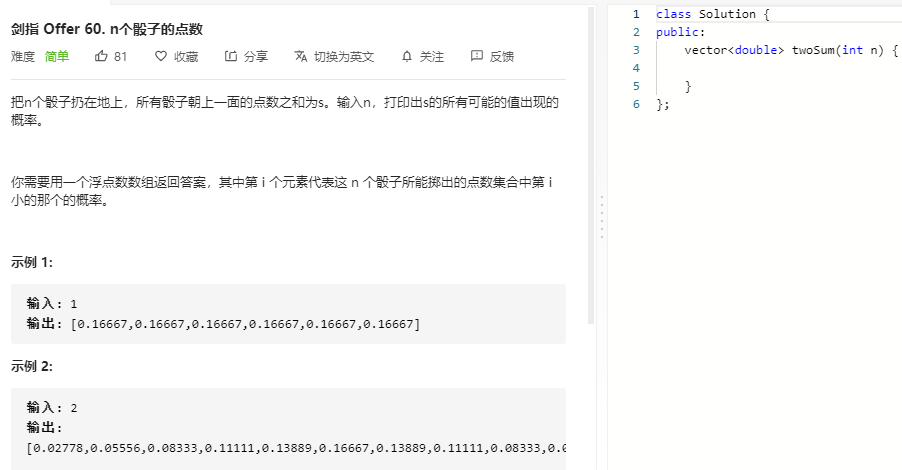

### 题目要求



### 解题思路

本题和求第k个字典序有点相似。首先找到它所在的范围，也就是以1开头的是$$1,(n-1)!$$，以2开头的是$$[(n-1)!, 2(n-1)!)$$，以此类推。固定一个数之后，选择下一个数，比如选择了2，当n=3时，剩余的数就是[1,3]，继续上述的操作。

### 本题代码

```c++
class Solution {
public:
    string getPermutation(int n, int k) {
        vector<int>vec;
        for(int i = 1;i <= n;i++){
            vec.push_back(i);
        }
        string res = "";
        while(n){
            int cur = mul(n-1);
            int index = (k-1)/cur;
            res += vec[index]+'0';
            vec.erase(vec.begin()+index);
            k -= index * cur;
            n--;
        }
        return res;
    }
    int mul(int n){
        int res = 1;
        for(int i = 1;i <= n;i++){
            res *= i;
        }
        return res;
    }
};
```

### [手撸测试](https://leetcode-cn.com/problems/permutation-sequence/) 

