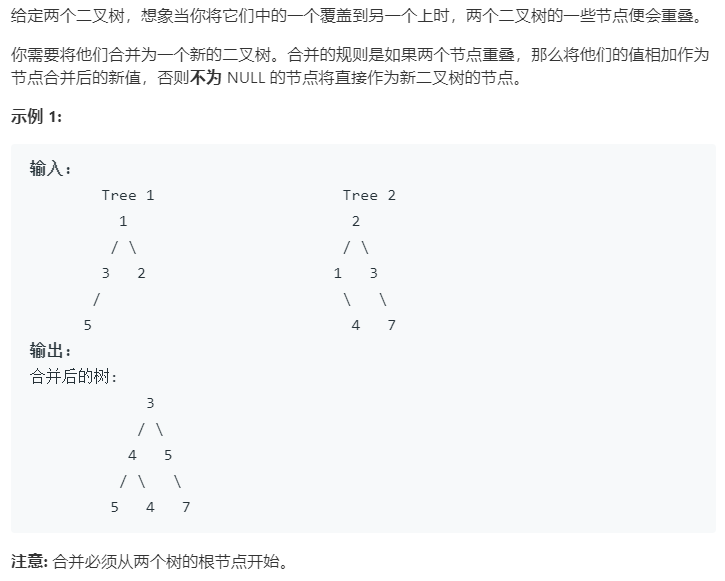

### 题目要求



### 解题思路

直接递归求解

### 本题代码

```c++
class Solution {
public:
    TreeNode* mergeTrees(TreeNode* t1, TreeNode* t2) {
        if(t1 == NULL)
            return t2;
        if(t2 == NULL)
            return t1;
        t1->val += t2->val;
        t1->left = mergeTrees(t1->left, t2->left);
        t1->right = mergeTrees(t1->right, t2->right);
        return t1;
    }
};
```

### [手撸测试](<https://leetcode-cn.com/problems/merge-two-binary-trees/>) 

