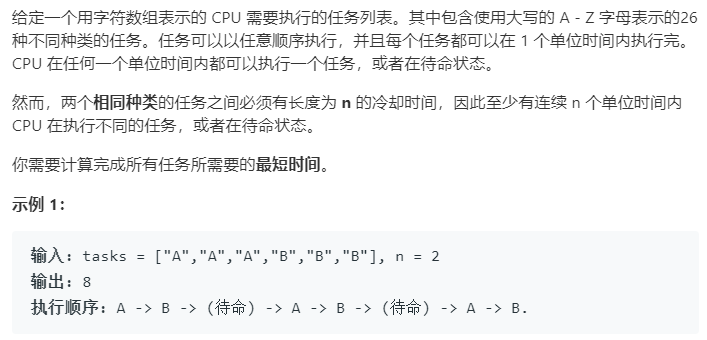

### 题目要求



### 解题思路

使用桶排序。设计桶的大小为 `n+1`，则相同的任务恰好不能放入同一个桶，最密也只能放入相邻的桶。因此对于重复的任务，只能将每个都放入不同的桶中，桶的个数就是重复次数最多的任务的个数。一个桶不管是否放满，其占用的时间均为 n+1，这是因为后面桶里的任务需要等待冷却时间。最后一个桶是个特例，由于其后没有其他任务需等待，所以占用的时间为桶中的任务个数。可以得到最少的时间为：总排队时间 = (桶个数 - 1) * (n + 1) + 1。有一个特殊情况需要注意--当任务重复率很低时，那么计算得到的桶个数很少，但由于任务数量很多，可能出现桶不够用的情况。此时可以假想在最后一桶之后又补充了很多个桶，且所有的桶均装满，因此最后需要判断任务的总等待时间即为任务的总个数。

### 本题代码

```c++
class Solution {
public:
    int leastInterval(vector<char>& tasks, int n) {
        if(tasks.size() <= 1 || n < 1)
            return tasks.size();
        vector<int>dp(26, 0);
        for(int i = 0;i < tasks.size();i++){
            dp[tasks[i] - 'A']++;
        }
        sort(dp.begin(), dp.end());
        int maxV = dp[25];
        int res = (maxV - 1) * (n + 1) + 1;
        int j = 24;
        while(j >= 0 && dp[j] == maxV){
            res++;
            j--;
        }
        return res > tasks.size() ? res : tasks.size();
    }
};
```

### [手撸测试](<https://leetcode-cn.com/problems/task-scheduler/>) 

