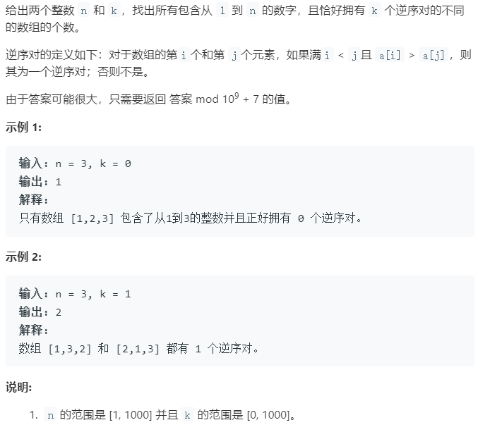
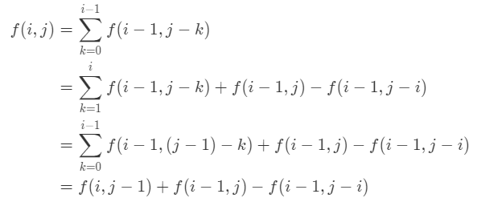

### 题目要求



### 解题思路

感谢`zqy1018`老哥的笔记讲解。设 $$f(i, j)$$表示前 $$i$$个数构成 $$j$$个逆序对的方案数目。如果算出来了前$$i - 1$$的答案，考虑把元素$$i$$插入到原来的序列里，插的位置不同会产生不同的逆序对数目。增加的逆序对数在$$(0,i-1)$$内，据此可以写出状态转移方程：$$f(i, j)=\sum_{k=0}^{i-1} f(i-1, j-k)$$。那么状态转移方程的推导化简：



### 本题代码

```c++
class Solution {
public:
    int kInversePairs(int n, int k) {
        vector<vector<int>>vec(n + 1, vector<int>(k + 1, 0));
        vec[0][0] = 1;
        for (int i = 1; i <= n; ++i){
            vec[i][0] = 1;
            for (int j = 1; j <= k; ++j){
                vec[i][j] = vec[i - 1][j] + vec[i][j - 1];
                if (vec[i][j] >= 1000000007) // 取模
                    vec[i][j] -= 1000000007;
                if (j >= i){
                    vec[i][j] += 1000000007 - vec[i - 1][j - i];
                    if (vec[i][j] >= 1000000007) // 取模  
                        vec[i][j] -= 1000000007;
                }
            }
        }
        return vec[n][k];
    }
};
```

### [手撸测试](<https://leetcode-cn.com/problems/k-inverse-pairs-array/>) 

