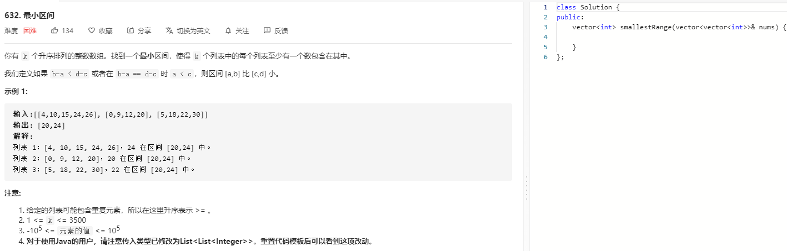
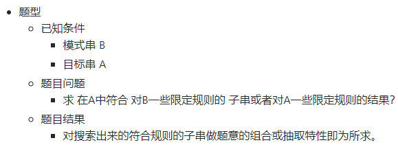
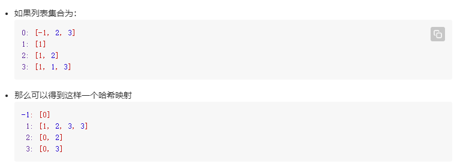

### 题目要求



### 解题思路

看代码量很唬人但是思路很清晰。典型的hash+滑动窗口的问题，套路是 [双指针+滑动窗口](https://github.com/Alex660/Algorithms-and-data-structures/blob/master/demos/滑动窗口11道.md) 套用思路是：

放到本题中就是有一个序列 $$A=\left\{a_{1}, a_{2}, \cdots, a_{n}\right\}$$ 和一个序列 $$B=\left\{b_{1}, b_{2}, \cdots, b_{m}\right\}$$ ,请找出一个$$B$$中的一个最小的区间，使得在这个区间中 $$A$$ 序列的每个数字至少出现一次，请注意 $$A$$ 中的元素可能重复，也就是说如果 $$A$$ 中有 $$p$$ 个 $$u$$，那么你选择的这个区间中 $$u$$ 的个数一定不少于 $$p$$。

那么哈希表就是以`nums`中每一个数为key，以该数出现的列表序列为value：



这时hash映射就是 $$B$$ 序列，那么遍历 $$B$$:(来源自leetcode 官方解释)

- 指向窗口右边界的指针右移当且仅当每次遍历到新的元素，并将这个新的元素对应的值数组中的每一个数加入到哈希表中
- 指向窗口左边界的指针右移当且仅当当前窗口内的元素包含 A 中所有的元素，同时将原来左边界对应的值数组的元素们从哈希表中移除
- 答案更新当且仅当当前窗口内的元素包含 A 中所有的元素

也就是维护一个unordered_map m--key是num，value是nums_index，从nums中找到最小的数和最大的数作为左右指针，右指针不断滑动，窗口需要满足所有的list都会在该窗口中出现(也就对应了至少一个数在该区间)，然后对满足的窗口缩减左指针，跟新最小区间的值，最终得到最后的结果。

### 本题代码

```c++
class Solution {
public:
    vector<int> smallestRange(vector<vector<int>>& nums) {
        int n = nums.size();
        unordered_map<int, vector<int>>m;
        int minV = INT_MAX, maxV = INT_MIN;
        for(int i = 0;i < n;i++){
            for(auto x: nums[i]){
                m[x].push_back(i);
                minV = min(minV, x);
                maxV = max(maxV, x);
            }   
        }
        int left = minV, right = minV-1;
        int bestleft =minV, bestright = maxV;
        int inside = 0;
        vector<int>freq(n);
        while(right < maxV){
            right++;
            if(m.count(right)){
                for(auto x: m[right]){
                    freq[x]++;
                    if(freq[x] == 1)
                        inside++;
                }
                while(inside == n){
                    if(right - left < bestright - bestleft){
                        bestright = right;
                        bestleft = left;
                    }
                    if(m.count(left)){
                        for(auto x: m[left]){
                            freq[x]--;
                            if(freq[x] == 0)
                                inside--;
                        }
                    }
                    left++;
                }
            }
        }
        return {bestleft, bestright};

    }
};
```

### [手撸测试](https://leetcode-cn.com/problems/smallest-range-covering-elements-from-k-lists/)  

