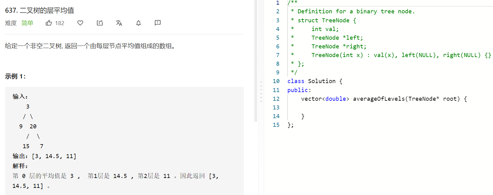

### 题目要求



### 解题思路

直接手撸。

### 本题代码

```c++
class Solution {
public:
    vector<double> averageOfLevels(TreeNode* root) {
        vector<double>res;
        if(root == NULL)
            return res;
        queue<TreeNode*>q;
        q.push(root);
        while(!q.empty()){
            int size = q.size();
            double sum = 0.0;
            double cnt = 0.0;
            while(size--){
                TreeNode* node = q.front();
                sum += node->val;
                if(node->left)
                    q.push(node->left);
                if(node->right)
                    q.push(node->right);
                q.pop();
                cnt += 1;
            }
            res.push_back(sum/cnt);
        }
        return res;
    }
};
```

### [手撸测试](https://leetcode-cn.com/problems/average-of-levels-in-binary-tree/)  

