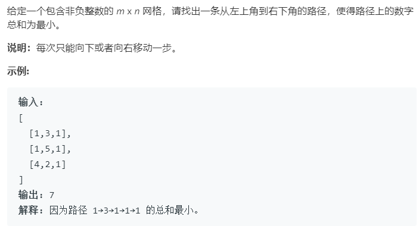

### 题目要求



### 解题思路

和 [62题](62.md) 的思路类似，只是更新网格中的点的时候需要保留最小值。

### 本题代码

```c++
class Solution {
public:
    int minPathSum(vector<vector<int>>& grid) {
        if(grid.size() == 0)
            return 0;
        int m = grid.size();
        int n = grid[0].size();
        for(int i = 1;i < m;i++){
            grid[i][0] += grid[i - 1][0];
        }
        for(int j = 1;j < n;j++){
            grid[0][j] += grid[0][j - 1];
        }
        for(int i = 1;i < m;i++){
            for(int j = 1;j < n;j++){
                grid[i][j] += min(grid[i][j - 1],grid[i - 1][j]);
            }
        }
        return grid[m - 1][n - 1];
    }
};
```

### [手撸测试](<https://leetcode-cn.com/problems/minimum-path-sum/>) 

