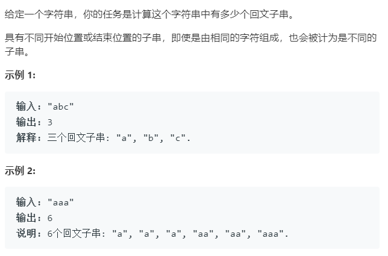

### 题目要求



### 解题思路

解题思路两种：(1)中心扩展法；(2)动态规划。解题思路和 [5 最长回文子串](5.md) 一样。这里不详写。

### 本题代码

#### 解法一 中心扩展法

```c++
class Solution {
public:
    int countSubstrings(string s) {
        int res = 0;
        for(int i = 0;i < s.size();i++){
            res += get(s, i, i);
            res += get(s, i, i + 1);
        }
        return res;
    }
    int get(string s, int l, int r){
        int count = 0;
        while(l >= 0 && r < s.size() && s[l] == s[r]){
            l--;
            r++;
            count++;
        }
        return count;
    }
};
```

#### 解法二 动态规划

```c++
class Solution {
public:
    int countSubstrings(string s) {
        int len = s.size();
        if(len <= 1)
            return len;
        int dp[len][len] = {0};
        int res = 1;
        for(int r = 1;r < len;r++){
            for(int l = 0;l <= r;l++){
                if(l == r)
                    dp[l][r] = 1;
                else if(s[l] == s[r] && (r - l <= 2 || dp[l + 1][r - 1] == 1))
                    dp[l][r] = 1;
                else
                    dp[l][r] = 0;
                if(dp[l][r] == 1)
                    res++;
            }
        }
        return res;
    }
};
```

### [手撸测试](<https://leetcode-cn.com/problems/palindromic-substrings/>) 

