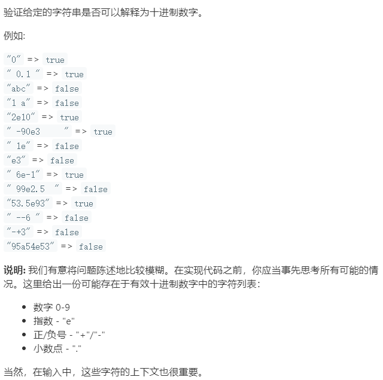

### 题目要求



### 解题思路

直接法。按照题意，遇到不满足就返回`false`，如果能走到最后就返回`true`。首先跳过空格，然后记录数字和小数点的个数(直到遇到字母字符)，如果数字小于1或者小数点大于1就返回`fasle`，接着当遇到字母字符就先判断是否为`e`若是就判断下一位是否符号位然后跳过。接着就一直判断是否是数字，若数字个数小于1就返回`false`。然后有空格就跳过，要是没有空格就会直接判断是否到最后，若能到最后就返回`true`，否则返回`false`。

### 本题代码

```c++
class Solution {
public:
    bool isNumber(string s) {
        if(s.size() == 0)
            return false;
        int i = 0;
        int nd = 0;
        int np = 0;
        //将开头的空格略去
        while(s[i] == ' ')
            i++;
        //将第一个符号位跳过
        if(s[i] == '-' || s[i] == '+')
            i++;
        
        //记录e符号或者其他符号出现前数字次数以及小数点次数
        for(;(s[i] >= '0' && s[i] <= '9') || s[i] == '.';i++){
            if(s[i] == '.')
                np++;
            else
                nd++;
        }
        //数字至少出现1次 小数点最多出现1次
        if(nd < 1 || np > 1)
            return false;
        //出现e后 意味着前面一定有合法的数字
        //后面遇到第一个符号位就跳过 然后遍历记录数字 数字至少出现1次
        if(s[i] == 'e'){
            i++;
            if(s[i] == '-' || s[i] == '+')
                i++;
            for(nd = 0;s[i] >= '0' && s[i] <= '9';i++,nd++);
            if(nd < 1)
                return false;
        }
        //将后面的空格跳过
        while(s[i] == ' ')
            i++;
        // 看看能不能走到最后
        return s[i] == 0;
    }
};
```

### [手撸测试](<https://leetcode-cn.com/problems/valid-number/>) 
