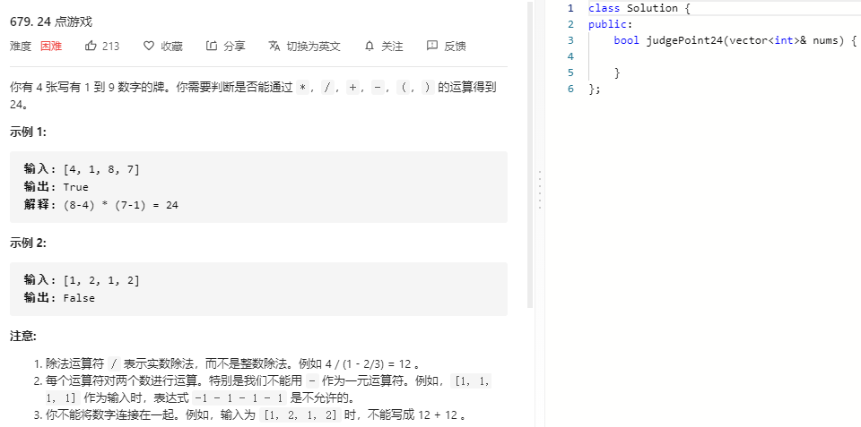

### 题目要求



### 解题思路

回溯法。选择两个数去做加减乘除，然后与剩余的数做加减乘除，最后得到最后一位数是否是24就算判断完成。

### 本题代码

```c++
class Solution {
public:
    double eps = 1e-6;
    // int add = 0, mult = 1, sub = 2, div = 3;
    bool judgePoint24(vector<int>& nums) {
        vector<double>list;
        for(int i = 0;i < nums.size();i++)
            list.push_back(double(nums[i]));
        return helper(list);
    }
    bool helper(vector<double>& list){
        if(list.size() <= 0)
            return false;
        if(list.size() == 1)
            return fabs(list[0] - 24) < eps;
        for(int i = 0;i < list.size();i++){
            for(int j = 0;j < list.size();j++){
                if(i != j){
                    vector<double>l;
                    for(int k = 0;k < list.size();k++){//其余与i和j不同的数
                        if(k != i && k != j)
                            l.push_back(list[k]);
                    }
                    for(int k = 0;k < 4;k++){
                        if(k < 2 && i > j) //加法和乘法具有结合律 可以互换
                            continue;
                        if(k == 0)
                            l.push_back(list[i] + list[j]);
                        else if(k == 1)
                            l.push_back(list[i] * list[j]);
                        else if(k == 2)
                            l.push_back(list[i] - list[j]);
                        else{
                            if(fabs(list[j]) < eps)
                                continue;
                            l.push_back(list[i] / list[j]);
                        }
                        if(helper(l))
                            return true;
                        l.pop_back();
                    }
                }
            }
        }
        return false;
    }
};
```

### [手撸测试](https://leetcode-cn.com/problems/24-game/)  

