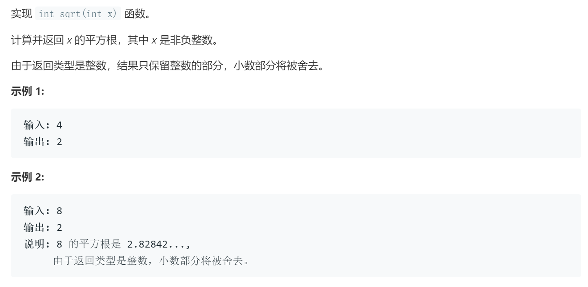

### 题目要求



### 解题思路

#### 解法1 二分法

二分法很简单就不具体展开写，注意的条件是(1)当`x`为`0`和为负数时该如何处理；(2)**当输入的x是`INT_MAX`时怎么处理**

#### 解法2 牛顿法

牛顿法的介绍可以参考[如何通俗易懂地讲解牛顿迭代法?](https://www.matongxue.com/madocs/205.html)，直接套用公式就可以解决：$$x_{k+1}=x_k-f(x_k)/f′(x_k)$$，这里$$f(x) = x^2-n$$，可以推导出更新公式为：$$x_{k+1}=x_k - (x_k^2 - n)/(2*x_k)=(x_k + x_k / n)/2$$。只要定义了停止迭代的条件就可以计算出不同预定范围内的精确值。 

### 本题代码

#### 解法1 二分法

```c++
class Solution {
public:
    int mySqrt(int x) {
        if(x < 0)
            return -1;
        int l = 1, r = x;
        int ans = 0;//为了0值
        while(l <= r){
            int mid = l + (r - l) / 2; //防止当x=INT_MAX时溢出
            int div = x / mid;
            if(div == mid)
                return mid;
            else if(div > mid){
                ans = mid;
                l = mid + 1;
            }
            else{
                r = mid - 1;
            }
        }
        return ans;
    }
};
```

#### 解法2 牛顿法

```c++
class Solution {
public:
    bool is_vail(int x, long n){
        if(n * n - x >= -0.1 && n * n - x <= 0.1)
            return false;
        else
            return true;
    }
    int mySqrt(int x) {
        long n = x;
        while(n * n > x){
            n = (x / n + n) / 2;
        }
        return int(n);
    }
};
```

### [手撸测试](https://leetcode-cn.com/problems/sqrtx/) 

