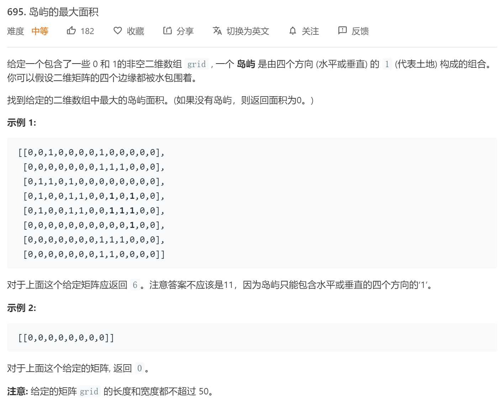

### 题目要求



### 解题思路

`DFS`直接手撸，思路来源于[岛屿的数据量](200.md) 。

### 本题代码

```c++
class Solution {
public:
    int maxAreaOfIsland(vector<vector<int>>& grid) {
        if(grid.size() == 0)
            return 0;
        int res = 0;
        for(int i = 0;i < grid.size();i++){
            for(int j = 0;j < grid[0].size();j++){
                if(grid[i][j] == 1){
                    int maxv = 0;
                    help(grid, i, j, maxv);
                    res = max(res, maxv);
                }
            }
        }
        return res;
    }
    void help(vector<vector<int>>& grid, int i, int j, int& maxv){
        if(i < 0 || i >= grid.size() || j < 0 || j >= grid[0].size() || grid[i][j] != 1)
            return;
        grid[i][j] = 2;
        maxv += 1;
        help(grid, i+1, j, maxv);
        help(grid, i-1, j, maxv);
        help(grid, i, j+1, maxv);
        help(grid, i, j-1, maxv);
    }
};
```

### [手撸测试](https://leetcode-cn.com/problems/max-area-of-island/)  

