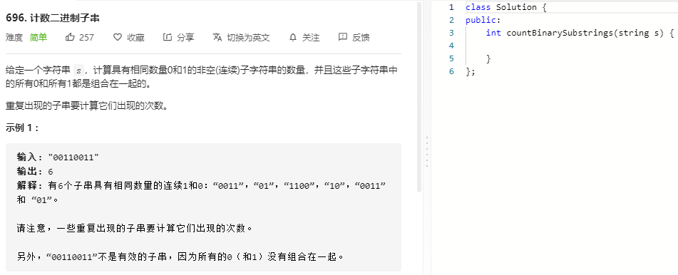
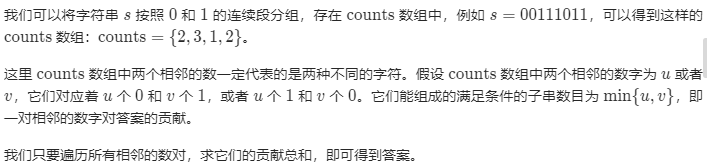

### 题目要求



### 解题思路



### 本题代码

```c++
public:
    int countBinarySubstrings(string s) {
        if(s.size() <= 0)
            return 0;
        int left = 0, right = 1;
        int count = 0;
        int res = 0;
        while(right < s.size()){
            if(s[left] != s[right]){
                res += min(count, right-left);
                count = right - left;
                left = right;
            }
            right++;
        }
        res += count < (s.size()-left) ? count : s.size()-left;
        return res;
    }
};
```

### [手撸测试](https://leetcode-cn.com/problems/count-binary-substrings/submissions/)  

