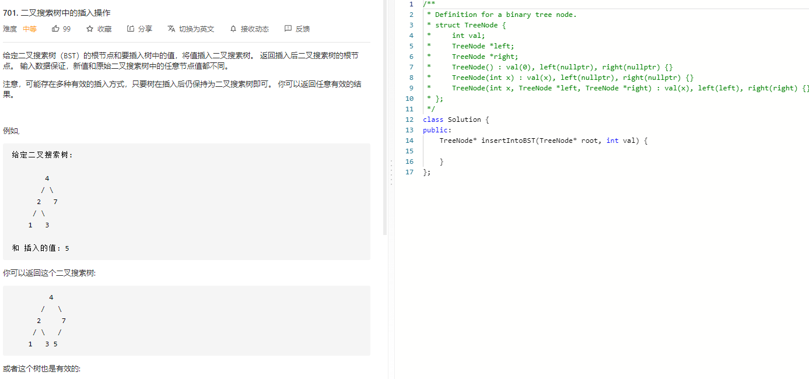

### 题目要求



### 解题思路

直接手撸

### 本题代码

```c++
/**
 * Definition for a binary tree node.
 * struct TreeNode {
 *     int val;
 *     TreeNode *left;
 *     TreeNode *right;
 *     TreeNode() : val(0), left(nullptr), right(nullptr) {}
 *     TreeNode(int x) : val(x), left(nullptr), right(nullptr) {}
 *     TreeNode(int x, TreeNode *left, TreeNode *right) : val(x), left(left), right(right) {}
 * };
 */
class Solution {
public:
    TreeNode* insertIntoBST(TreeNode* root, int val) {
        if(root == NULL)
            return new TreeNode(val);
        TreeNode* node = root;
        TreeNode* pre = NULL;
        bool left = false;
        while(node != NULL){
            pre = node;
            if(val > node->val){
                node = node->right;
                left = false;
            }
            else{
                node = node->left;
                left = true;
            }
        }
        if(left)
            pre->left = new TreeNode(val);
        else
            pre->right = new TreeNode(val);
        return root;
    }
};
```

### [手撸测试](https://leetcode-cn.com/problems/insert-into-a-binary-search-tree/) 
