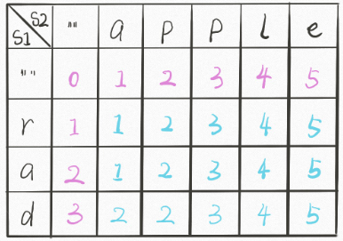

### 题目要求


### 解题思路

非常经典的面试题，感谢`labuladong`老哥的讲解，本思路使用的是动态规划的解法。具体上，`word1`每一个和`word2`不同的字符都有三种方式--删除、替换以及插入，因此动态规划转移可以参考下图：


当`word1[i-1]==word2[j-1]`时就跳过，当两者不相等时：`dp[i][j-1]`表示的是插入，`dp[i - 1][j]`表示的是删除，`dp[i - 1][j - 1]`表示的是替换操作。以`apple`和`rap`为例，动态规划表为：



粉红色的就是动态规划的初始边界。

### 本题代码

```c++
class Solution {
public:
    int minDistance(string word1, string word2) {
        if(word1.size() == 0 || word2.size() == 0)
            return word1.size() ? word1.size() : word2.size();
        int n = word1.size();
        int m = word2.size();
        int dp[n + 1][m + 1] = {0};
        for(int i = 0;i <= n;i++){ // 边界条件
            dp[i][0] = i;
        }
        for(int i = 0;i <= m;i++){
            dp[0][i] = i;
        }
        for(int i = 1;i <= n;i++){
            for(int j = 1;j <= m;j++){
                if(word1[i - 1] == word2[j - 1]){
                    dp[i][j] = dp[i - 1][j - 1];
                }
                else{
                    dp[i][j] = min(min(dp[i - 1][j] + 1, dp[i][j - 1] + 1), dp[i - 1][j - 1] + 1);
                }
            }
        }
        return dp[n][m];
    }
};
```

### [手撸测试](<https://leetcode-cn.com/problems/edit-distance/>) 
