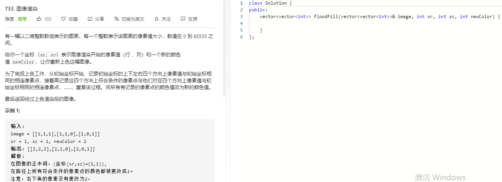

### 题目要求



### 解题思路

DFS直接手撸。

### 本题代码

```c++
class Solution {
public:
    vector<vector<int>> floodFill(vector<vector<int>>& image, int sr, int sc, int newColor) {
        if(image.size() == 0)
            return vector<vector<int>>();
        int color = image[sr][sc];
        if(image[sr][sc] != newColor)
            helper(image, sr, sc, color, newColor); //如果其实直接相等就可以不用染色
        return image;
    }
    void  helper(vector<vector<int>>& image, int sr, int sc, int color, int newColor){
        int n = image.size();
        int m = image[0].size();
        if(sr < n && sr >= 0 && sc < m && sc >= 0 && image[sr][sc] == color){
            image[sr][sc] = newColor;
            helper(image, sr+1, sc, color, newColor);
            helper(image, sr-1, sc, color, newColor);
            helper(image, sr, sc+1, color, newColor);
            helper(image, sr, sc-1, color, newColor);
        }
    }
};
```

### [手撸测试](https://leetcode-cn.com/problems/flood-fill/)  

