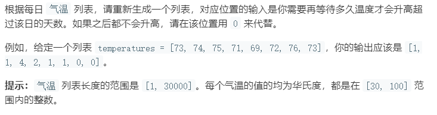

### 题目要求



### 解题思路

单调栈+逆序遍历。其实思路和那个窗口最大值有些关联，逆序遍历的原因是根据题意逆序遍历更容易找到温度高的值得位置。单调栈是保持从栈顶到栈底的递增序列。

### 本题代码

```c++
class Solution {
public:
    vector<int> dailyTemperatures(vector<int>& T) {
        if(T.size() == 0)
            return vector<int>();
        stack<int>s;
        vector<int>res(T.size(), 0);
        for(int i = T.size() - 1;i >= 0;i--){
            while(!s.empty() && T[i] >= T[s.top()])
                s.pop();
            res[i] = s.empty() ? 0 : s.top() - i;
            s.push(i);
        }
        return res;
    }
};
```

### [手撸测试](<https://leetcode-cn.com/problems/daily-temperatures/>) 

