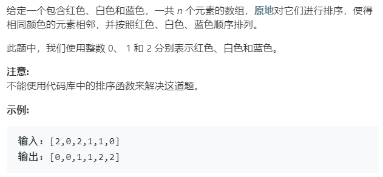

### 75 [颜色分类](https://leetcode-cn.com/problems/sort-colors/)

### 题目要求



### 解题思路

本题源于荷兰国旗问题。可以使用原地双指针解决。一个指针`i`表示的是0的最右边界，另一个指针`j`表示的是2的最左边界。

### 本题代码

```c++
class solution{
    void sortColors(vector<int>& nums){
        if(nums.size() == 0)
            return;
        int i = 0; // 0的最右边界
        int j = nums.size() - 1; // 2的最左边界
        for(int k = 0;k <= j;k++){ // 如果这里不是相等，那么[2,0,1]的输出为[1,0,2]
            if(nums[k] == 2){
                swap(nums, k, j);
                j--; // 2的最左边界更新
                k--; // 从新判断nums[k] 不担心k=-1--接下来for循环会＋1
            }
            else if(nums[k] == 0){
                swap(nums, i, k);//将新的0放到0的最右边界上
                i++; //更新0的最右边界
            }
        }
    }
    void swap(vector<int>& nums, int i, int j){
        int temp = nums[i];
        nums[i] = nums[j];
        nums[j] = temp;
    }
}
```

