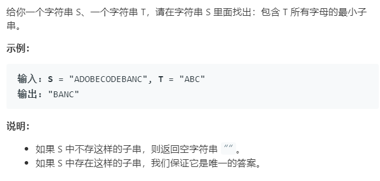

### 题目要求



### 解题思路

双指针法套路。套路是有框架的，建立两个`hash`表--一个用来维护指针窗口`win`另一个维护`mt`(也就是字符串T匹配项目)。当`win`里面的匹配项满足`mt`就开始判断条件。具体问题有不同的判断要求，详细看代码。具体思路是：右指针往右走，当`win`里面的匹配项满足`mt`后，移动`left`记录更新长度。

### 本题代码

```c++
class Solution {
public:
    string minWindow(string s, string t) {
        if(s.size() == 0 || t.size() == 0)
            return "";
        unordered_map<char, int>win;
        unordered_map<char, int>mt;
        for(auto c : t)
            mt[c]++;
        int right = 0;
        int left = 0;
        int match = 0;
        int minl = INT_MAX;
        int start = 0;
        while(right < s.size()){
            char c1 = s[right];
            if(mt.count(c1) != 0){
                win[c1]++;
                if(win[c1] == mt[c1])
                    match++;
            }
            right++;
            while(match == mt.size()){
                if(right - left < minl){
                    start = left;
                    minl = right - left;
                }
                char c2 = s[left];
                if(mt.count(c2) != 0){
                    win[c2]--;
                    if(win[c2] < mt[c2])
                        match--;
                }
                left++;
            }
        }
        return minl == INT_MAX ? "" : s.substr(start, minl);
    }
};
```

### [手撸测试](<https://leetcode-cn.com/problems/minimum-window-substring/>) 

