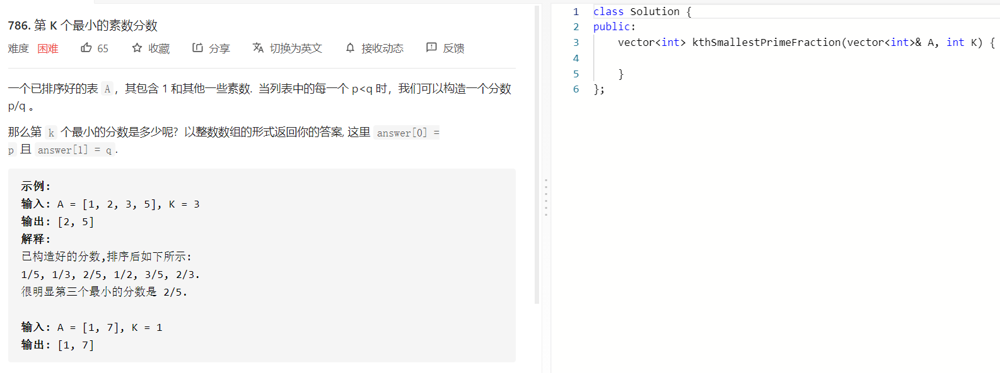

### 题目要求



### 解题思路

当看到顺序排好以及某个数值有一定范围的时候，二分查找是需要优先考虑的解法。本题属于高级二叉搜索法，边界判定的条件已经不是简单的大小关系，而是可以抽离出的子函数的情况。本题是一个套路题。可参考 [Grandyang](https://www.cnblogs.com/grandyang/p/9135156.html) 

本题中分数可能无限接近于0也可以无限接近于1，因此构成的分数在(0,1)之间。mid作为candidate，从头到尾的对A进行扫描，直到小于mid，就可以得到小于mid的个数cnt。因为一旦 cnt 等于K了，直接将这个候选值返回即可，这个候选值分数是由p和q来表示的，其中p表示分子，初始化为0，q表示分母，初始化为1（因为除数不能为0），在内部的 while 循环退出时，分数 A[i]/A[j] 就是最接近 mid 的候选者，此时假如 p/q 要小于 A[i]/A[j]，就要分别更新p和q。否则如果 cnt 小于K，说明应该增大一些 mid，将 left 赋值为 mid，反之如果 cnt 大于K，需要减小 mid，将 right 赋值为 mid，参见代码如下：

### 本题代码

```c++
class Solution {
public:
    vector<int> kthSmallestPrimeFraction(vector<int>& A, int K) {
        double left = 0, right = 1;
        int p = 0, q = 1, cnt = 0, n = A.size();
        while (true) {
            double mid = left + (right - left) / 2.0;
            cnt = 0; p = 0;
            for (int i = 0, j = 0; i < n; ++i) {
                while (j < n && A[i] > mid * A[j]) ++j;
                cnt += n - j;
                if (j < n && p * A[j] < q * A[i]) {
                    p = A[i];
                    q = A[j];
                }
            }
            if (cnt == K) return {p, q};
            if (cnt < K) left = mid;
            else right = mid;
        }
    }
};
```

### [手撸测试](https://leetcode-cn.com/problems/k-th-smallest-prime-fraction/)  

