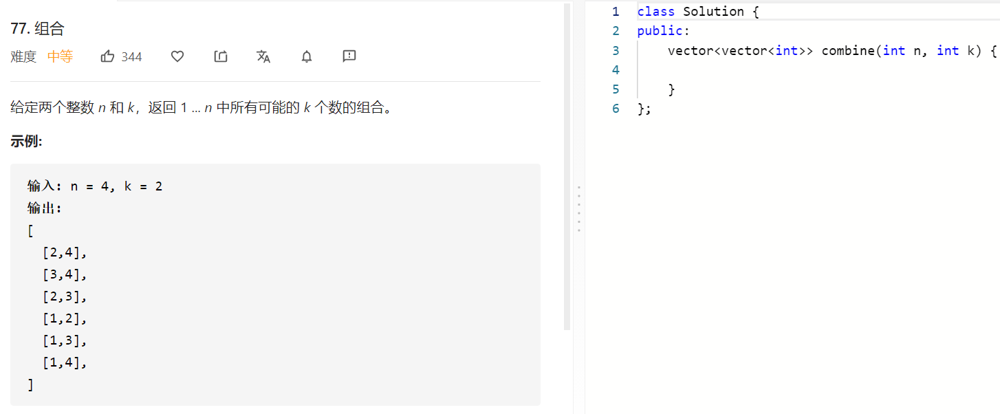

### 题目要求



### 解题思路

解法一：直接回溯放一个位置一个位置放，但是放的时候需要注意不要重复。另外注意一个提前终止的条件

解法二：经典回溯，选择放和选择不放。

### 本题代码

方法一

```c++
class Solution {
public:
    vector<vector<int>>res;
    vector<vector<int>> combine(int n, int k) {
        if(n <= 0 || k <= 0 || k > n)
            return res;
        
        for(int i = 1;i <= n;i++){
            vector<int>path;
            path.push_back(i);
            permu(path, 1, n, k);
        }
        return res;
    }
    void permu(vector<int>& path, int index, int n, int k){
        if(path.size() == k){
            res.push_back(path);
        }
        else{
            for(int i = index;i <= n;i++){
                if(is_ok(path, i)){
                    path.push_back(i);
                    permu(path, i, n, k);
                    path.pop_back();
                }
            }
        }
    }
    bool is_ok(vector<int>& path, int index){
        if(path.size() + n - index + 1 < k) //提前终止
            return false;
        for(auto num: path){
            if(num == index || num > index) //防止path中元素重复以及防止res中path重复
                return false;
        }
        return true;
    }
};
```

方法二

```c++
class Solution {
public:
    vector<vector<int>>res;
    vector<vector<int>> combine(int n, int k) {
        vector<int>path;
        dfs(path, n, k, 1);
        return res;
    }
    void dfs(vector<int>& path, int n, int k, int cur){
        if(path.size() + n - cur + 1 < k)
            return;
        if(path.size() == k){
            res.push_back(path);
            return;
        }
        path.push_back(cur);
        dfs(path, n, k, cur+1);
        path.pop_back();
        dfs(path, n, k, cur+1);
            
    }
};
```

### [手撸测试](https://leetcode-cn.com/problems/combinations/)  

