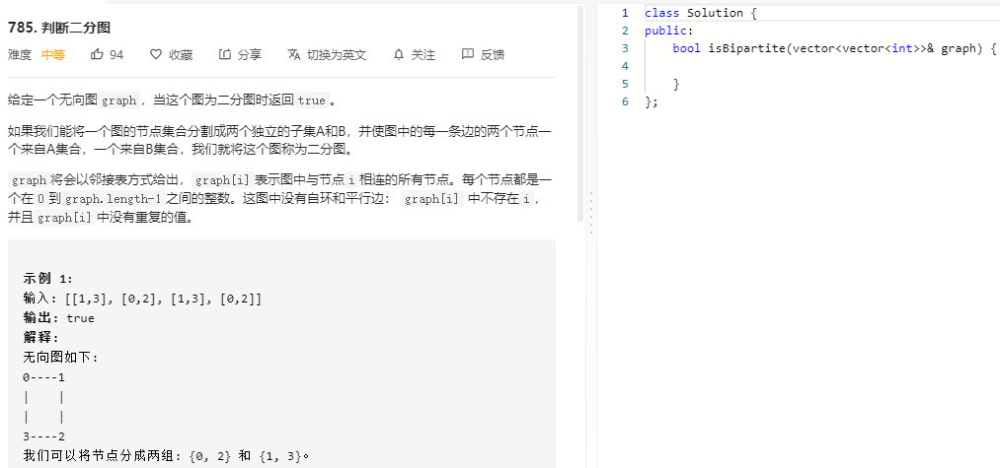

### 题目要求



### 解题思路

图的深度优先搜索。核心在于当两个节点`u`和`v`属于同一个集合的时候，他们一定不相连。因此可以使用颜色来标记：`uncolor`、`red`、`green`。相邻的节点和本节点一定是不同颜色的，如果相邻没有颜色就`dfs`把相邻的节点染色，如果颜色相同就返回`false`，否则就返回`true`。

### 本题代码

```c++
class Solution {
public:
    int uncolor = 0;
    int green = 1;
    int red = 2;
    vector<int>color;
    bool vaild;
    bool isBipartite(vector<vector<int>>& graph) {
        int n = graph.size();
        color.assign(n, 0);
        vaild = true;
        for(int i = 0;i < n && vaild;i++){
            if(color[i] == uncolor)
                dfs(graph, i, red); //如果没有颜色就染色
        }
        return vaild;
    }
    void dfs(vector<vector<int>>& graph, int i, int c){
        color[i] = c;
        int cN = c == red ? green : red; //相邻的节点颜色是相反的
        for(int n: graph[i]){ // 列表中所有元素的范围是 0~n-1, n是graph的大小
            if(color[n] == uncolor){ //如果邻接点没有颜色，染色并dfs
                dfs(graph, n, cN);
                if(!vaild)
                    return;
            }
            else if(color[n] != cN){ //如果有颜色，判断
                vaild = false;
                return;
            }
        }
    }
};
```

### [手撸测试](https://leetcode-cn.com/problems/is-graph-bipartite/)  

