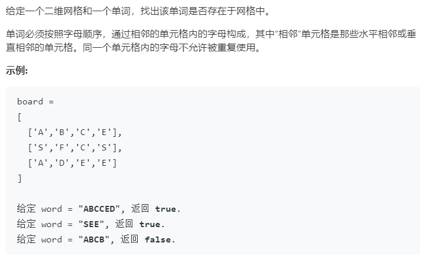

### 题目要求



### 解题思路

直接回溯。但是写法不同也会导致时间效率差别很大，下面两个都是回溯，但是定义了方向矩阵的回溯明显时间复杂度更低。

### 本题代码

不带方向矩阵

```c++
class Solution {
public:
    bool exist(vector<vector<char>>& board, string word) {
        if(word.size() == 0 || board.size() == 0)
            return false;
        int m = board.size();
        int n = board[0].size();
        vector<vector<int>>flag(m, vector<int>(n, 0));
        for(int i = 0;i < m;i++){
            for(int j = 0;j < n;j++){
                if(hasPath(board, word, i, j, 0, flag))
                    return true;
            }
        }
        return false;
    }
    bool hasPath(vector<vector<char>>& board, string word, int i, int j, int k, vector<vector<int>>& flag){
        if(i < 0 || i >= board.size() || j < 0 || j >= board[0].size() || board[i][j] != word[k] || flag[i][j] == 1)
            return false;
        if(k == word.size() - 1)
            return true;
        flag[i][j] = 1;
        if(hasPath(board, word, i + 1, j, k + 1, flag) || hasPath(board, word, i - 1, j, k + 1, flag) || hasPath(board, word, i, j + 1, k + 1, flag) || hasPath(board, word, i, j - 1, k + 1, flag))
            return true;
        flag[i][j] = 0;
        return false;
    }
};
```

带方向矩阵

```c++
class Solution {
public:
    int dir[4][4]={{-1,0},{1,0},{0,-1},{0,1}};
    
    bool exist(vector<vector<char>>& board, string word) {
        int m=board.size();
        int n=board[0].size();
        vector<vector<bool>> visited(m,vector<bool>(n));
        
        
        for(int i=0;i<m;i++){
            for(int j=0;j<n;j++){
                if(dfs(i,j,0,board,word,visited))
                    return true;
            }
        }
        return false;
    }
    
    bool dfs(int x,int y,int index,vector<vector<char>>& board,string &word,vector<vector<bool>>& visited){
        if(index==word.size()-1){
            return word[index]==board[x][y];
        }
        
        if(word[index]==board[x][y]){
            visited[x][y]=true;
            for(int i=0;i<4;i++){
                int new_x=x+dir[i][0];
                int new_y=y+dir[i][1];
                
                if(new_x>=0&&new_x<board.size()&&new_y>=0&&new_y<board[0].size()&&!visited[new_x][new_y])
                    if(dfs(new_x,new_y,index+1,board,word,visited))
                        return true;
            }
            visited[x][y]=false;
            
        }
        return false;
    }
};
```

### [手撸测试](<https://leetcode-cn.com/problems/word-search/>) 

