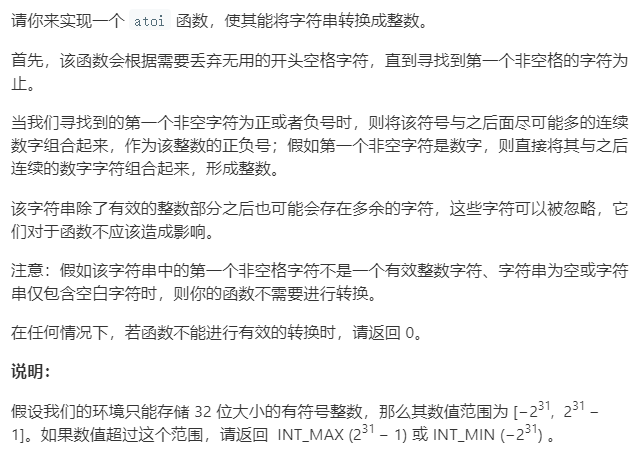

### 题目要求



### 解题思路

解题思路就是直接法。先把空格跳过，然后遇到符号了设置符号变量然后跳过，接着开始转换合法的数字。注意要保证数字的大小不要超过最大最小值。

### 本题代码

```c++
class Solution {
public:
    int myAtoi(string str) {
        if(str.size() == 0)
            return 0;
        int res = 0;
        int i = 0;
        while(str[i] == ' ')
            i++;
        int flag = 1;
        if(str[i] == '-')//遇到符号位设置符号
            flag = 0;
        if(str[i] == '+' || str[i] == '-')//跳过符号位
            i++;
        //如果有符号位数字必须紧跟符号位 否则返回为0
        //另外 题意中已经强调第一个非空之后不是符号位的话必须为数字
        while(i < str.size() && (str[i] >= '0' && str[i] <= '9')){
            int cur = str[i] - '0';
            if(res > INT_MAX / 10 ||(res == INT_MAX / 10 && cur >= -(INT_MIN % 10)))
                return flag > 0 ? INT_MAX : INT_MIN;
            res = res * 10 + cur;
            i++;
        }
        return flag > 0 ? res : -res;
    }
};
```

### [手撸测试](<https://leetcode-cn.com/problems/string-to-integer-atoi/>) 
