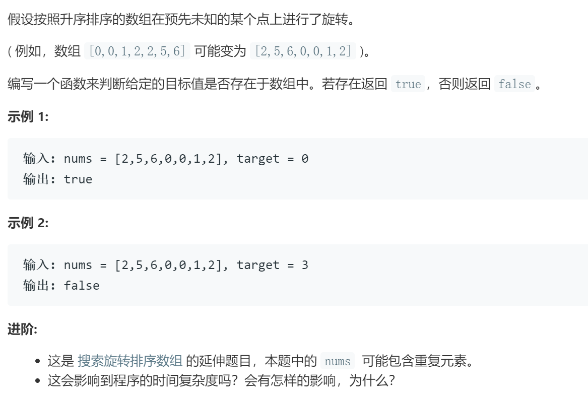

### 题目要求



### 解题思路

参考[Leetcode 33](33.md) .

### 本题代码

```c++
class Solution {
public:
    bool search(vector<int>& nums, int target) {
        if(nums.size() == 0)
            return false;
        int low = 0, heigh = nums.size() - 1;
        while(low <= heigh){
            int mid = low + (heigh - low) / 2;
            if(nums[mid] == target)
                return true;
            if(nums[low] == nums[mid] && nums[mid] == nums[heigh]){
                while(low < mid && nums[low] == nums[mid]){
                    low++;
                }
                if(low == mid){
                    low = mid + 1;
                    continue;
                }
            }
            else if(nums[low] != nums[mid]){
                if(nums[low] < nums[mid]){
                    if(target >= nums[low] && target < nums[mid])
                        heigh = mid - 1;
                    else
                        low = mid + 1;
                }
                else{
                    if(target > nums[mid] && target <= nums[heigh])
                        low = mid + 1;
                    else
                        heigh = mid - 1;
                }
            }
            else if(nums[heigh] != nums[mid]){
                if(nums[mid] < nums[heigh]){
                    if(nums[heigh] >= target && target > nums[mid])
                        low = mid + 1;
                    else
                        heigh = mid - 1;
                }
                else{
                    if(nums[low] <= target && target < nums[mid])
                        heigh = mid - 1;
                    else
                        low = mid + 1;
                }
            }
        }
        return false;
    }
};
```

### [手撸测试](https://leetcode-cn.com/problems/search-in-rotated-sorted-array-ii/)  

