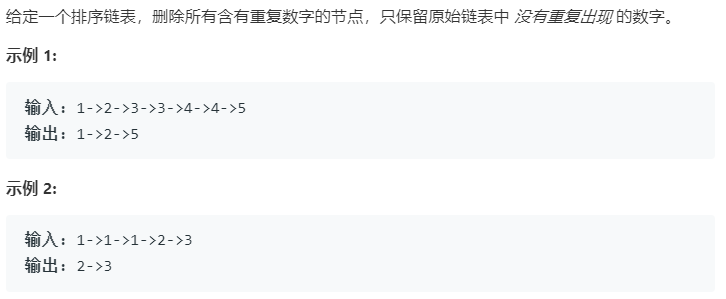

### 题目要求



### 解题思路

直接从前往后的遍历。该题是不要所有重复的数字，那就需要定义一个`Head`指针。更新很有意思，详细看代码。

### 本题代码

```c++
class Solution {
public:
    ListNode* deleteDuplicates(ListNode* head) {
        if(head == NULL || head->next == NULL)
            return head;
        ListNode* Head = new ListNode(0);
        Head->next = head;
        ListNode* pre = Head;
        ListNode* cur = Head->next;
        while(cur){
            if(cur->next && cur->val == cur->next->val){
                while(cur->next && cur->val == cur->next->val)
                    cur = cur->next;
                pre->next = cur->next;
                cur = cur->next;
            }
            else{
                pre = pre->next;
                cur = cur->next;
            }
        }
        return Head->next;
    }
};
```

### [手撸测试](<https://leetcode-cn.com/problems/remove-duplicates-from-sorted-list-ii/>) 

