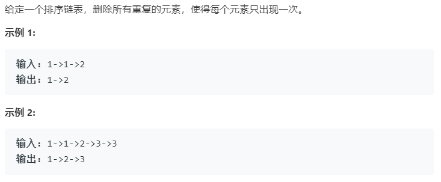

### 题目要求



### 解题思路

思路和 [82题](82.md) 很像，主要是别把重复的删除了。

### 本题代码

```c++
class Solution {
public:
    ListNode* deleteDuplicates(ListNode* head) {
        if(head == NULL || head->next == NULL)
            return head;
        ListNode* cur = head;
        while(cur != NULL && cur->next != NULL){
            if(cur->val == cur->next->val)
                cur->next = cur->next->next;
            else
                cur = cur->next;
        }
        return head;
    }
};
```

### [手撸测试](<https://leetcode-cn.com/problems/remove-duplicates-from-sorted-list/>) 

