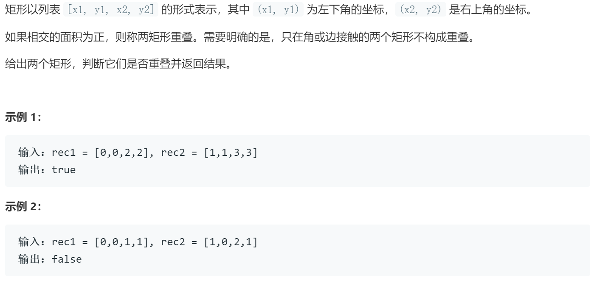

### 题目要求



### 解题思路

二维问题的降维处理，变成区间重叠做。另外，区间重叠采用正难则反的思路。正着想重叠情况很多，可以从反面考虑不重叠的情况，然后取反。

### 本题代码

```c++
class Solution {
public:
    bool isRectangleOverlap(vector<int>& rec1, vector<int>& rec2) {
        bool x_overlop = !(rec1[0] >= rec2[2] || rec1[2] <= rec2[0]);
        bool y_overlop = !(rec1[1] >= rec2[3] || rec1[3] <= rec2[1]);
        return x_overlop && y_overlop;
    }
};
```

### [手撸测试](https://leetcode-cn.com/problems/rectangle-overlap/)  

