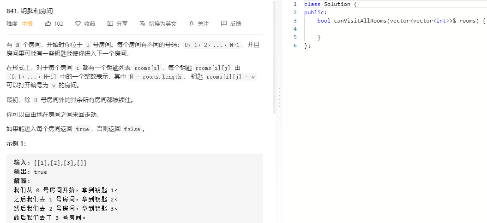

### 题目要求



### 解题思路

带记忆的广度优先搜索即可。

### 本题代码

```c++
class Solution {
public:
    bool canVisitAllRooms(vector<vector<int>>& rooms) {
        if(rooms.size() == 0)
            return 0;
        queue<int>q;
        vector<int>visit(rooms.size(), 0);
        visit[0] = 1;
        for(auto x: rooms[0])
            q.push(x);
        while(!q.empty()){
            int size = q.size();
            while(size--){
                int index = q.front();
                q.pop();
                if(visit[index] == 1)
                    continue;
                for(auto x: rooms[index])
                    q.push(x);
                visit[index] = 1;
            }
        }
        for(auto x: visit)
            if(x == 0)
                return false;
        return true;
    }
};
```

### [手撸测试](https://leetcode-cn.com/problems/keys-and-rooms/)  

