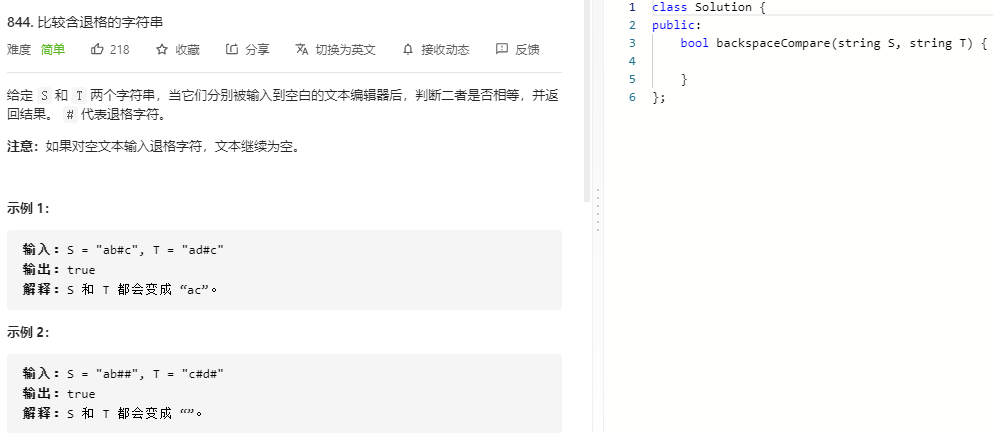

### 题目要求



### 解题思路

将所有的#可以删除的字符都删除之后，如果相等那么就一定相等。这种操作可以使用栈来帮助解决。

### 本题代码

```c++
class Solution {
public:
    bool backspaceCompare(string S, string T) {
        return helper(S) == helper(T);
    }

    string helper(string s){
        if(s.size() == 0)
            return "";
        string res;
        stack<char>sk;
        for(int i = 0;i < s.size();i++){
            if(s[i] != '#')
                sk.push(s[i]);
            else{
                if(!sk.empty())
                    sk.pop();
            }
        }
        while(!sk.empty()){
            res += sk.top();
            sk.pop();
        }
            
        return res;
    }
};
```

### [手撸测试](https://leetcode-cn.com/problems/backspace-string-compare/) 

