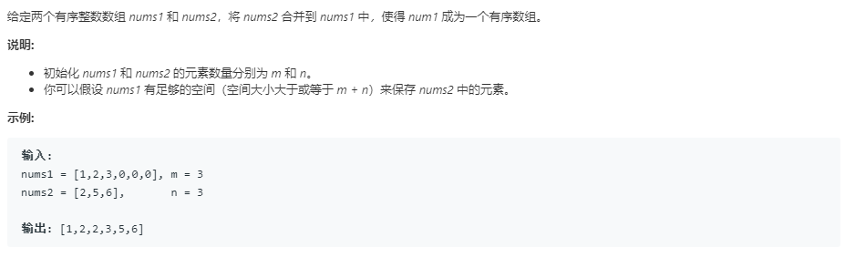

### 题目要求



### 解题思路

三个指针法。因为已经是排序好的数组，因此直接可以使用将最大的放到数组后面。从大到小放置即从后往前合并。

### 本题代码

```c++
class Solution {
public:
    void merge(vector<int>& nums1, int m, vector<int>& nums2, int n) {
        int i = m - 1; //从末尾开始
        int j = n - 1; //从末尾开始
        int k = m + n - 1; //从末尾开始
        while (j >= 0) {
            if (i < 0) {
                while (j >= 0) {
                    nums1[k--] = nums2[j--];
                }
                return;
            }
            //按照末尾放置数目
            if (nums1[i] > nums2[j]) {
                nums1[k--] = nums1[i--];
            } else {
                nums1[k--] = nums2[j--];
            }
        }
    }
};
```

### [手撸测试](https://leetcode-cn.com/problems/merge-sorted-array/)  

