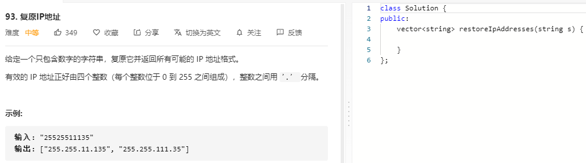

### 题目要求



### 解题思路

解法一：直接爆搜，因为知道每一个长度在于4，所以三个指针直接爆搜；

解法二：回溯，先遍历第一部分，然后遍历第二部分直到最后一部分。

### 本题代码

#### 解法一 爆搜

```c++
class Solution {
public:
    vector<string> restoreIpAddresses(string s) {
        if(s.size() == 0)
            return vector<string>();
        vector<string>res;
        int len = s.size();
        for(int a = 1;a < 4 && a < len-2;a++){
            for(int b = a+1;(b<a+4) && (b<len-1);b++){
                for(int c = b+1;c<b+4 && c<len;c++){
                    string s1 = s.substr(0, a);
                    string s2 = s.substr(a, b-a);
                    string s3 = s.substr(b, c-b);
                    string s4 = s.substr(c);
                    if(isvail(s1) && isvail(s2) && isvail(s3) && isvail(s4))
                        res.push_back(s1+'.'+s2+'.'+s3+'.'+s4);
                }
            }
        }  
        return res;
    }
    bool isvail(string s){
        if(s.size() == 0 || s.size() > 3 || stoi(s) > 255 || (s.size() > 1 && s[0] == '0'))
            return false;
        return true;
    }
};
```

#### 解法二

### [手撸测试](https://leetcode-cn.com/problems/restore-ip-addresses/)  

