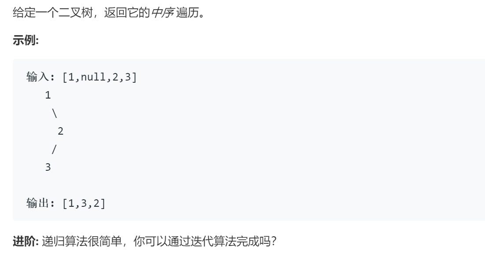

### 题目要求



### 解题思路

递归和非递归直接撸。

### 本题代码

#### 递归版

```c++
class Solution {
public:
    vector<int> inorderTraversal(TreeNode* root) {
        vector<int>res;
        dfs(root, res);
        return res;
    }
    void dfs(TreeNode* root, vector<int>& res){
        if(!root)
            return;
        dfs(root->left, res);
        res.push_back(root->val);
        dfs(root->right, res);
    }
};
```

#### 非递归

```c++
class Solution {
public:
    vector<int> inorderTraversal(TreeNode* root) {
        stack<TreeNode*>s;
        vector<int>res;
        if(root){
            while(!s.empty() || root != NULL){
                if(root != NULL){
                    s.push(root);
                    root = root->left;
                }
                else{
                    root = s.top();
                    s.pop();
                    res.push_back(root->val);
                    root = root->right;
                }
            }
        }
        return res;
    }
};
```

### [手撸测试](https://leetcode-cn.com/problems/binary-tree-inorder-traversal/)  

