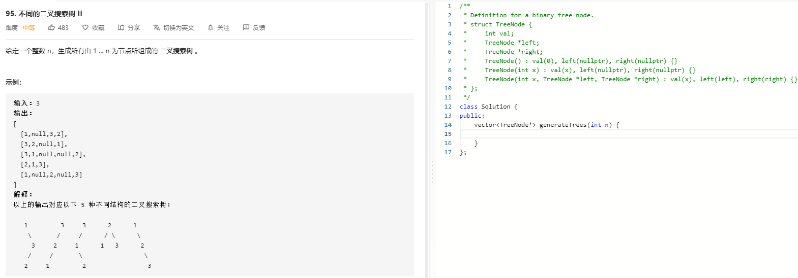

### 题目要求



### 解题思路

动态规划解决。对于1~i节点，选择j作为根节点，左数有j-1个节点，右数有i-j个节点。其中每个节点长度的树结构个数是固定的，可以直接复用左数，但是复用右数节点时每个节点需要加上根节点偏置。

### 本题代码

```c++
class Solution {
public:
    vector<TreeNode*> generateTrees(int n) {
        vector<vector<TreeNode*>>dp(n+1);
        if(n <= 0)
            return dp[0];
        dp[0].push_back(NULL);
        for(int i = 1;i <= n;i++){
            for(int j = 1;j <= i;j++){
                int left = j-1;    //j是根节点上的数
                int right = i-j; //左右树的长度
                for(TreeNode* leftTree : dp[left]){
                    for(TreeNode* rightTree : dp[right]){
                        TreeNode* treeRoot = new TreeNode(j);
                        treeRoot->left = leftTree;
                        //克隆右子树并且加上偏差
                        treeRoot->right = copy(rightTree, j);
                        dp[i].push_back(treeRoot);
                    }
                }
            }
        }
        return dp[n];
    }
    TreeNode* copy(TreeNode* node, int offet){
        if(node == NULL)
            return node;
        TreeNode* root = new TreeNode(node->val + offet);
        root->left = copy(node->left, offet);
        root->right = copy(node->right, offet);
        return root;
    }
};
```

### [手撸测试](https://leetcode-cn.com/problems/unique-binary-search-trees-ii/) 

