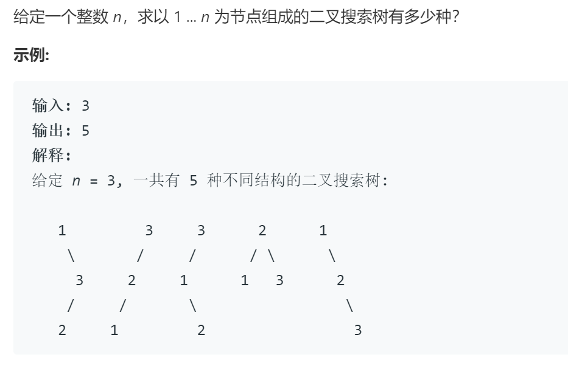
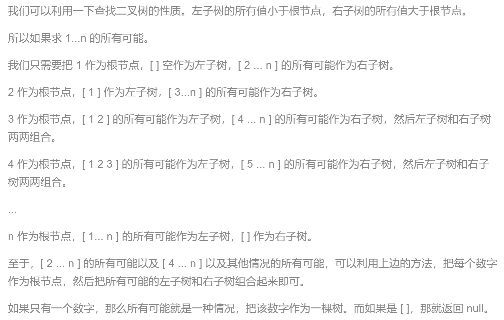
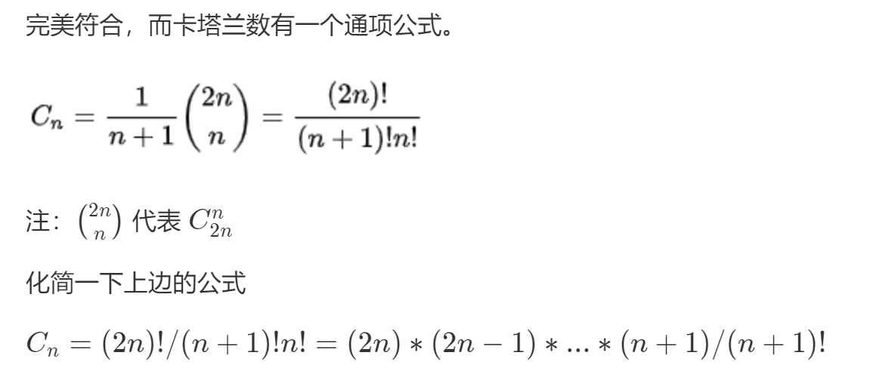

### 题目要求



### 解题思路

整体可参考：

#### 解法一递归

递归的思想很简单，左边右边相乘即可，自顶向下，使用hash来保存中间值复用。

#### 解法二 动态规划

对于每一个`i`，复用动态规划表。

#### 解法三 卡塔兰数

卡塔兰数据列定义：

> 令h ( 0 ) = 1，catalan 数满足递推式：
>
> h ( n ) = h ( 0 ) \* h ( n - 1 ) + h ( 1 ) \* h ( n - 2 ) + ... + h ( n - 1 ) \* h ( 0 ) ( n >=1 )
>
> 例如：h ( 2 ) = h ( 0 ) * h ( 1 ) + h ( 1 ) * h ( 0 ) = 1 * 1 + 1 * 1 = 2
>
> h ( 3 ) = h ( 0 ) * h ( 2 ) + h ( 1 ) * h ( 1 ) + h ( 2 ) * h ( 0 ) = 1 * 2 + 1 * 1 + 2 * 1 = 5

通项以及化简如下：



### 本题代码

#### 递归

```c++
class Solution {
public:
    int numTrees(int n) {
        if(n == 0 || n == 1)
            return n;
        unordered_map<int, int>m;
        return dfs(n, m);
    }
    int dfs(int n, unordered_map<int, int>& m){
        if(m[n] != 0)
            return m[n];
        if(n == 0 || n == 1)
            return 1;
        int ans = 0;
        for(int i = 1;i <= n;i++){
            int left = dfs(i-1, m);
            int right = dfs(n-i, m);
            ans += left * right;
        }
        m[n] = ans;
        return ans;
    }
};
```

#### 动态规划

```c++
class Solution {
public:
    int numTrees(int n) {
        if(n == 0)
            return 0;
        vector<int>dp(n+1, 0);
        dp[0] = 1;
        for(int i = 1;i <= n;i++){
            for(int j = 1;j <=i;j++){
                dp[i] += dp[j-1] * dp[i-j];
            }
        }
        return dp[n];
    }
};
```

#### 卡塔兰数

```c++
class Solution {
public:
    int numTrees(int n) {
        if(n == 0)
            return n;
        long ans = 1, i;
        for (i = 1; i <= n; i++)
            ans = ans * (i + n) / i;
        return (int) (ans / i);
    }
};
```

### [手撸测试](https://leetcode.wang/leetCode-96-Unique-Binary-Search-Trees.html) 

