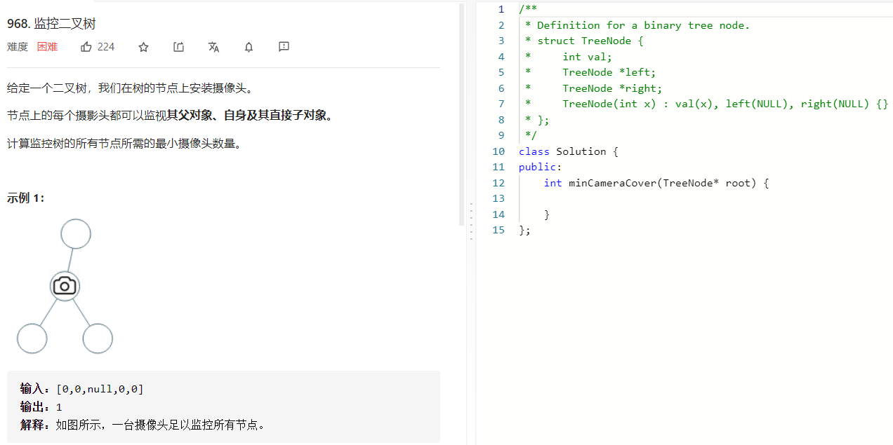

### 题目要求



### 解题思路

使用三个状态来标注，no_visual表示没有被相机覆盖，no_need表示不需要相机覆盖，have_visual表示放相机覆盖。深度优先遍历

### 本题代码

```c++
class Solution {
public:
    int no_visual = 0;
    int no_need = 1;
    int have_visual = 2;
    int res = 0;
    int minCameraCover(TreeNode* root) {
        if(dfs(root) == no_visual)
            res++;
        return res;
    }
    int dfs(TreeNode* root){
        //如果是空的，就不需要相机了
        if(root == NULL)
            return no_need;
        int left = dfs(root->left);
        int right = dfs(root->right);
        //如果左右子节点有一个是no_visual，表示的是子节点既没相机，也没相机覆盖它，
        //所以当前节点需要有一个相机
        if(left == no_visual || right == no_visual){
            res++;
            return have_visual;
        }
        //如果左右子节点只要有一个有相机，那么当前节点就不需要相机了，否则返回一个没有相机的标记
        return left == have_visual || right == have_visual ? no_need : no_visual;
    }
};
```

### [手撸测试](https://leetcode-cn.com/problems/binary-tree-cameras/) 

 