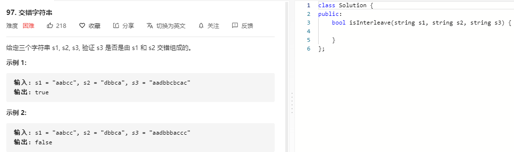

### 题目要求



### 解题思路

回溯以及动态规划都可以解决，要求是`s3`保证`s1`和`s2`两个字符串组合顺序。

回溯解法：三个指针`i`,`j`,`k`分别指向三个字符串，当s1[i] == s3[k]并且s2[j] != s3[k]时，i往前走;同理可以得到j往前走；当s1[i]==s3[k]并且s2[j]\==s[k]时，就有回溯，选择i或者j往前走。

动态规划解法：定义一个 boolean 二维数组 dp [ i ] [ j ] 来表示 s1[ 0, i ) 和 s2 [ 0, j ） 组合后能否构成 s3 [ 0, i + j )，注意不包括右边界，主要是为了考虑开始的时候如果只取 s1，那么 s2 就是空串，这样的话 dp [ i ] [ 0 ] 就能表示 s2 取空串。

状态转换方程也很好写了，如果要求 `dp[i][j]` 。

- 如果 dp [ i - 1 ] [ j ] == true，并且 s1 [ i - 1 ] == s3 [ i + j - 1]， dp [ i ] [ j ] = true 。

- 如果 dp [ i ] [ j - 1 ] == true，并且 s2 [ j - 1 ] == s3 [ i + j - 1]， dp [ i ] [ j ] = true 。

- 否则的话，就更新为 dp [ i ] [ j ] = false。

- 如果 i 为 0，或者 j 为 0，那直接判断 s2 和 s3 对应的字母或者 s1 和 s3 对应的字母即可。

### 本题代码

#### 解法一 回溯+带记忆

```c++

```

#### 解法二 动态规划

```c++
class Solution {
public:
    bool isInterleave(string s1, string s2, string s3) {
        if(s1.size() + s2.size() != s3.size())
            return false;
        int n = s1.size(), m = s2.size();
        vector<vector<bool>>dp(n+1, vector<bool>(m+1, false));
        for(int i = 0;i <= n;i++){
            for(int j = 0;j <= m;j++){
                if(i == 0 && j == 0)
                    dp[i][j] = true;
                else if(i == 0)
                    dp[i][j] = dp[i][j-1] && s2[j-1] == s3[j-1];
                else if(j == 0)
                    dp[i][j] = dp[i-1][j] && s1[i-1] == s3[i-1];
                else
                    dp[i][j] = (dp[i-1][j] == true && s1[i-1] == s3[i+j-1]) || (dp[i][j-1] && s2[j-1] == s3[i+j-1]);
            }
        }
        return dp[n][m];
    }
};
```

### [手撸测试](https://leetcode-cn.com/problems/interleaving-string/) 

