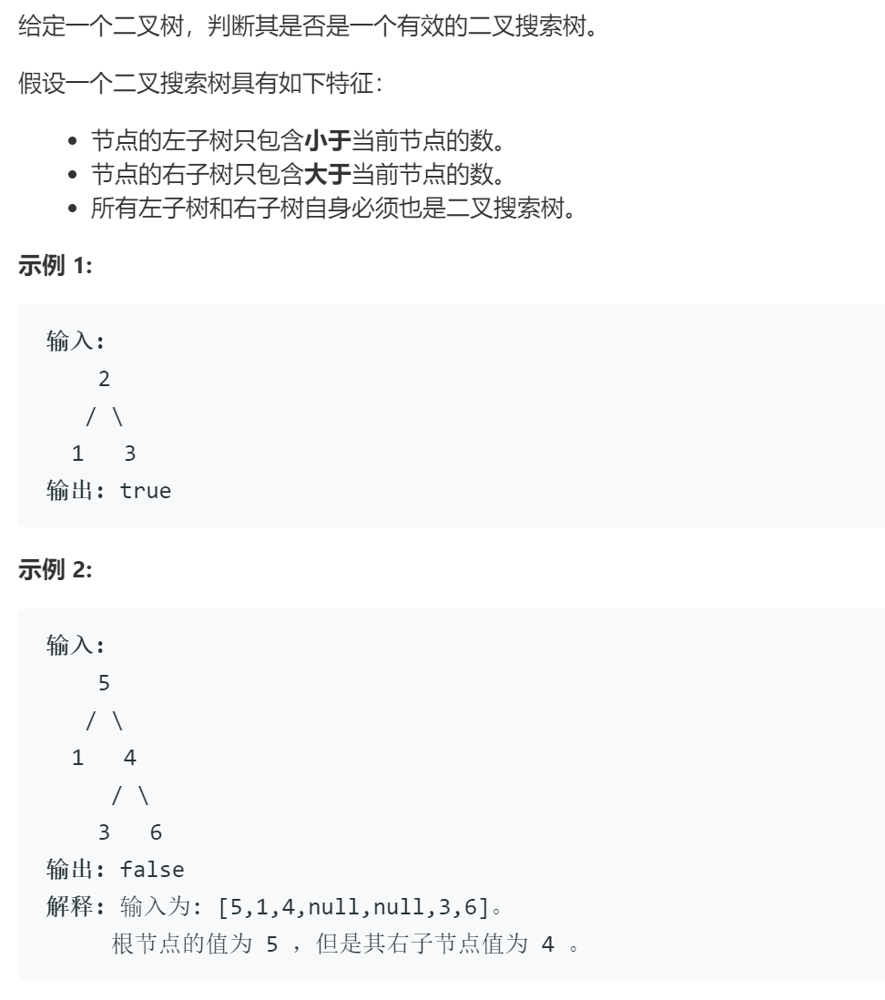

### 题目要求



### 解题思路

看见二叉搜索树，大概率往中序遍历上靠。遍历的方式有递归和循环，一般来说所有的递归够可以使用栈来模拟。

### 本题代码

#### 栈模拟

```c++
class Solution {
public:
    bool isValidBST(TreeNode* root) {
        if(root == NULL)
            return true;
        stack<TreeNode*>s;
        long m = LONG_MIN;
        while(!s.empty() || root != NULL){
            if(root != NULL){
                s.push(root);
                root = root->left;
            }
            else{
                root = s.top();
                s.pop();
                if(root->val <= m)
                    return false;
                m = root->val;
                root = root->right;
            }
        }
        return true;
    }
};
```

#### 递归

```c++
class Solution {
public:
    bool isValidBST(TreeNode* root) {
        if(!root)
            return true;
        long left = LONG_MIN;
        long right = LONG_MAX;
        return help(root, left, right);
    }
    bool help(TreeNode* root, long left, long right){
        if(!root)
            return true;
        if(root->val <= left || root->val >= right)
            return false;
        return help(root->left, left, root->val) && help(root->right, root->val, right);
    }
};
```

### [手撸测试](https://leetcode-cn.com/problems/validate-binary-search-tree/submissions/)  

