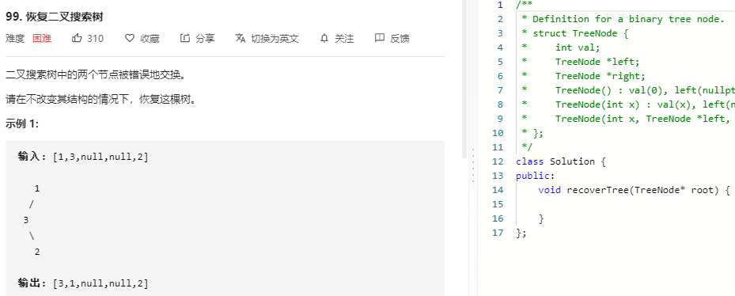

### 题目要求



### 解题思路

不用递归方法的中序遍历。在中序遍历的过程我们只需要**维护当前中序遍历到的最后一个节点$$\textit{pred}$$**，然后在遍历到下一个节点的时候，看两个节点的值是否满足前者小于后者即可，如果不满足说明找到了一个交换的节点，且在找到两次以后就可以终止遍历。

### 本题代码

```c++
class Solution {
public:
    void recoverTree(TreeNode* root) {
        stack<TreeNode*> stk;
        TreeNode* x = nullptr;
        TreeNode* y = nullptr;
        TreeNode* pred = nullptr;

        while (!stk.empty() || root != nullptr) {
            while (root != nullptr) {
                stk.push(root);
                root = root->left;
            }
            root = stk.top();
            stk.pop();
            if (pred != nullptr && root->val < pred->val) {
                y = root;
                if (x == nullptr) {
                    x = pred;
                }
                else break;
            }
            pred = root;
            root = root->right;
        }
        swap(x->val, y->val);
    }
};
```

### [手撸测试](https://leetcode-cn.com/problems/recover-binary-search-tree/)  

