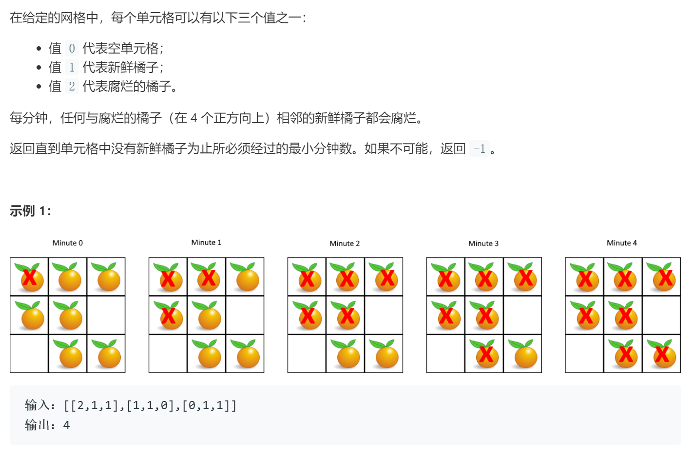

### 题目要求



### 解题思路

`DFS`遍历。队列里是`rotten`的坐标，每次把现有的`rotten`上下左右遍历完，变为`rotten`的放到队列下次迭代，`fresh`变量记录未坏橘子的数量，布尔变量`rotten`决定是否有橘子变坏(变坏`rotten`减1)。

### 本题代码

```c++
class Solution {
public:
    int orangesRotting(vector<vector<int>>& grid) {
        int min = 0, fresh = 0;
        queue<pair<int, int>>q;
        for(int i = 0;i < grid.size();i++){
            for(int j = 0;j < grid[0].size();j++){
                if(grid[i][j] == 1)
                    fresh++;
                else if(grid[i][j] == 2)
                    q.push(make_pair(i,j));
            }
        }
        vector<pair<int, int>>direction = {{-1, 0}, {1, 0}, {0, -1}, {0, 1}};//注意和i,j对应
        while(!q.empty()){
            int size = q.size();
            bool rotten = false;
            for(int i = 0;i < size;i++){
                auto x = q.front();
                q.pop();
                for(auto y : direction){
                    int i = x.first + y.first;
                    int j = x.second + y.second;
                    if(i < grid.size() && i >= 0 && j >= 0 && j < grid[0].size() && grid[i][j] == 1){
                        grid[i][j] = 2;
                        fresh--;
                        q.push({i,j});
                        rotten = true;
                    } 
                }
            }
            if(rotten)
                min++;
        }
        return fresh ? -1 : min;
    }
};
```

### [手撸测试](https://leetcode-cn.com/problems/rotting-oranges/)  

