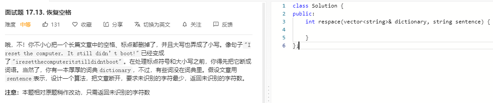

### 题目要求



### 解题思路

动态规划解法。`dp[i]`表示的是$$[0.i]$$的最小未识别个数，遍历`dictionary`中每一个单词看是否可以识别，如果可以识别则$$dp[i-len]$$,否则为$$dp[i-1]+1$$。

### 本题代码

```c++
class Solution {
public:
    int maxProfit(vector<int>& prices) {
        if(prices.size() < 2)
            return 0;
        vector<int>hold(prices.size(), 0);
        vector<int>unhold(prices.size(), 0);
        hold[0] = -prices[0];
        hold[1] = max(-prices[0], -prices[1]);
        unhold[1] = max(0, prices[1] - prices[0]);
        if(prices.size() == 2)
            return max(hold[1], unhold[1]);
        int res = INT_MIN;
        for(int i = 2;i < prices.size();i++){
            hold[i] = max(unhold[i - 2] - prices[i], hold[i - 1]);
            unhold[i] = max(unhold[i - 1], hold[i - 1] + prices[i]);
            res = max(res, max(hold[i], unhold[i]));
        }
        return res;
    }
};
```

### [手撸测试](https://leetcode-cn.com/problems/best-time-to-buy-and-sell-stock-with-cooldown/)  

