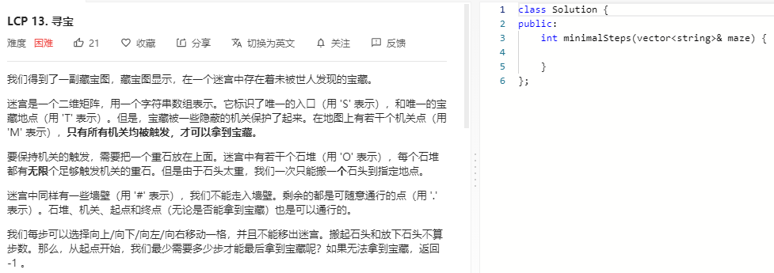

### 题目要求




### 解题思路

本题叫做旅行商问题。找到从S->O->M的最短然后找到M->O->M'最短矩阵。

### 本题代码

```c++
class Solution {
public:
    int dx[4] = {1, -1, 0, 0};
    int dy[4] = {0, 0, 1, -1};
    int n, m;

    bool inBound(int x, int y) {
        return x >= 0 && x < n && y >= 0 && y < m;
    }

    vector<vector<int>> bfs(int x, int y, vector<string>& maze) {
        vector<vector<int>> ret(n, vector<int>(m, -1));
        ret[x][y] = 0;
        queue<pair<int, int>> Q;
        Q.push({x, y});
        while (!Q.empty()) {
            auto p = Q.front();
            Q.pop();
            int x = p.first, y = p.second;
            for (int k = 0; k < 4; k++) {
                int nx = x + dx[k], ny = y + dy[k];
                if (inBound(nx, ny) && maze[nx][ny] != '#' && ret[nx][ny] == -1) {
                    ret[nx][ny] = ret[x][y] + 1;
                    Q.push({nx, ny});
                }
            }
        }
        return ret;
    }

    int minimalSteps(vector<string>& maze) {
        n = maze.size(), m = maze[0].size();
        // 机关 & 石头
        vector<pair<int, int>> buttons, stones;
        // 起点 & 终点
        int sx, sy, tx, ty;
        for (int i = 0; i < n; i++) {
            for (int j = 0; j < m; j++) {
                if (maze[i][j] == 'M') {
                    buttons.push_back({i, j});
                }
                if (maze[i][j] == 'O') {
                    stones.push_back({i, j});
                }
                if (maze[i][j] == 'S') {
                    sx = i, sy = j;
                }
                if (maze[i][j] == 'T') {
                    tx = i, ty = j;
                }
            }
        }
        int nb = buttons.size();
        int ns = stones.size();
        vector<vector<int>> start_dist = bfs(sx, sy, maze);

        // 边界情况：没有机关
        if (nb == 0) {
            return start_dist[tx][ty];
        }
        // 从某个机关到其他机关 / 起点与终点的最短距离。
        vector<vector<int>> dist(nb, vector<int>(nb + 2, -1));
        // 中间结果
        vector<vector<vector<int>>> dd(nb);
        for (int i = 0; i < nb; i++) {
            vector<vector<int>> d = bfs(buttons[i].first, buttons[i].second, maze);
            dd[i] = d;
            // 从某个点到终点不需要拿石头
            dist[i][nb + 1] = d[tx][ty];
        }

        for (int i = 0; i < nb; i++) {
            int tmp = -1;
            for (int k = 0; k < ns; k++) {
                int mid_x = stones[k].first, mid_y = stones[k].second;
                if (dd[i][mid_x][mid_y] != -1 && start_dist[mid_x][mid_y] != -1) {
                    if (tmp == -1 || tmp > dd[i][mid_x][mid_y] + start_dist[mid_x][mid_y]) {
                        tmp = dd[i][mid_x][mid_y] + start_dist[mid_x][mid_y];
                    }
                }
            }
            dist[i][nb] = tmp;
            for (int j = i + 1; j < nb; j++) {
                int mn = -1;
                for (int k = 0; k < ns; k++) {
                    int mid_x = stones[k].first, mid_y = stones[k].second;
                    if (dd[i][mid_x][mid_y] != -1 && dd[j][mid_x][mid_y] != -1) {
                        if (mn == -1 || mn > dd[i][mid_x][mid_y] + dd[j][mid_x][mid_y]) {
                            mn = dd[i][mid_x][mid_y] + dd[j][mid_x][mid_y];
                        }
                    }
                }
                dist[i][j] = mn;
                dist[j][i] = mn;
            }
        }

        // 无法达成的情形
        for (int i = 0; i < nb; i++) {
            if (dist[i][nb] == -1 || dist[i][nb + 1] == -1) return -1;
        }
        
        // dp 数组， -1 代表没有遍历到
        vector<vector<int>> dp(1 << nb, vector<int>(nb, -1));
        for (int i = 0; i < nb; i++) {
            dp[1 << i][i] = dist[i][nb];
        }
        
        // 由于更新的状态都比未更新的大，所以直接从小到大遍历即可
        for (int mask = 1; mask < (1 << nb); mask++) {
            for (int i = 0; i < nb; i++) {
                // 当前 dp 是合法的
                if (mask & (1 << i)) {
                    for (int j = 0; j < nb; j++) {
                        // j 不在 mask 里
                        if (!(mask & (1 << j))) {
                            int next = mask | (1 << j);
                            if (dp[next][j] == -1 || dp[next][j] > dp[mask][i] + dist[i][j]) {
                                dp[next][j] = dp[mask][i] + dist[i][j];
                            }
                        }
                    }
                }
            }
        }

        int ret = -1;
        int final_mask = (1 << nb) - 1;
        for (int i = 0; i < nb; i++) {
            if (ret == -1 || ret > dp[final_mask][i] + dist[i][nb + 1]) {
                ret = dp[final_mask][i] + dist[i][nb + 1];
            }
        }

        return ret;
    }
};
```

### [手撸测试](https://leetcode-cn.com/problems/xun-bao/)  

