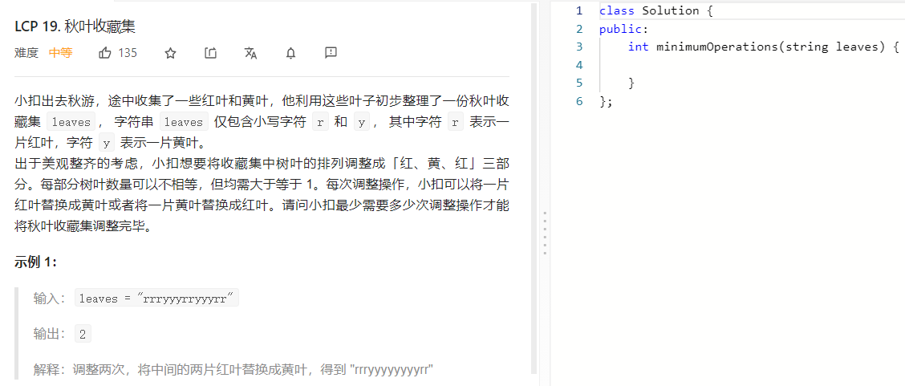

### 题目要求



### 解题思路

由于我们想要将收藏集中树叶的排列调整成「红、黄、红」三部分，因此我们可以用 3 个状态分别表示其中的每一部分，即状态 0 和状态 2 分别表示前面和后面的红色部分，状态 1 表示黄色部分。

此时，我们就可以尝试使用动态规划解决本题了。我们用 $$f[i][j]$$ 表示对于第 0 片到第 i 片叶子（记为 $$\textit{leaves}[0..i]$$进行调整操作，并且第 i 片叶子处于状态 j 时的最小操作次数。在推导状态转移方程时，我们可以分别对于每一种状态进行分析。

- 当 j=0 时，我们需要将第 i 片叶子变成红色，并且第 i-1 片叶子也只能处于 j=0 的状态（因为没有编号更小的状态了），因此有状态转移方程：$$f[i][0]=f[i−1][0]+isYellow(i)$$.
- 当 j=1 时，我们需要将第 i 片叶子**变成黄色**，而第 i-1 片叶子既可以处于 j=1 的状态，也可以处于 j=0 的状态，我们选择其中的较小值，因此有状态转移方程:$$f[i][1]=min\{f[i−1][0],f[i−1][1]\}+isRed(i)$$. isRed（*）表示是红色加1。
- 当 j=2时，我们需要将第 i片叶子变成红色，而第 i-1 片叶子即可以处于 j=2 的状态，也可以处于 j=1 的状态（注意这里不能处于 j=0j=0 的状态，因为每一种状态包含的叶子数量必须至少为 1），我们选择其中的较小值，因此有状态转移方程：$$f[i][2]=min\{f[i−1][1],f[i−1][2]\}+isYellow(i)$$.

- 

最终的答案即为 $$f[n-1][2]$$，其中 n 是字符串 $$\textit{leaves}$$ 的长度，也就是树叶的总数。

### 本题代码

```c++
class Solution {
public:
    int minimumOperations(string leaves) {
        int n = leaves.size();
        vector<vector<int>> f(n, vector<int>(3));
        f[0][0] = (leaves[0] == 'y');
        f[0][1] = f[0][2] = f[1][2] = INT_MAX;
        for (int i = 1; i < n; ++i) {
            int isRed = (leaves[i] == 'r');
            int isYellow = (leaves[i] == 'y');
            f[i][0] = f[i - 1][0] + isYellow;
            f[i][1] = min(f[i - 1][0], f[i - 1][1]) + isRed;
            if (i >= 2) {
                f[i][2] = min(f[i - 1][1], f[i - 1][2]) + isYellow;
            }
        }
        return f[n - 1][2];
    }
};
```

### [手撸测试](https://leetcode-cn.com/problems/UlBDOe/solution/) 

