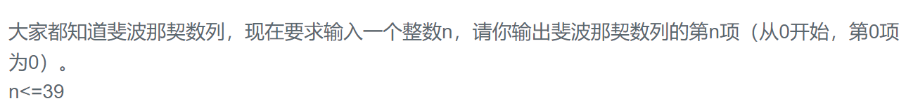

### 题目要求

#### 原题 斐波拉契数列



#### 扩展1 跳台阶


#### 扩展2 变态跳


#### 扩展3 矩形覆盖


### 解题思路

不提倡递归法，直接使用简单的动态规划。

### 本题代码

#### 原题 斐波拉契数列

```c++
class Solution {
public:
    int Fibonacci(int n) {
        if(n == 0)
            return 0;
        if(n == 1 || n == 2)
            return 1;
        int pre = 1;
        int res = 1;
        for(int i = 3;i <= n;i++){
            int temp = res;
            res += pre;
            pre = temp;
        }
        return res;
    }
};
```

#### 扩展1 跳台阶

```c++
class Solution {
public:
    int jumpFloor(int number) {
        if(number == 0 || number == 1 || number == 2)
            return number;
        int res = 2;
        int pre = 1;
        for(int i = 3;i <= number;i++){
            int temp = res;
            res += pre;
            pre = temp;
        }
        return res;
    }
};
```

#### 扩展2 变态跳

```c++
class Solution {
public:
    int jumpFloorII(int number) {
        if(number <=0)
            return 0;
        int res = 1 << (number - 1);
        return res;
    }
};
```

#### 扩展3 矩形覆盖

```c++
class Solution {
public:
    int rectCover(int number) {
        if(number <= 0)
            return 0;
        if(number == 1 || number == 2)
            return number;
        int pre = 1;
        int cur = 2;
        for(int i = 3;i <= number;i++){
            int temp = cur;
            cur += pre;
            pre = temp;
        }
        return cur;
    }
};
```

### [手撸测试](https://www.nowcoder.com/practice/c6c7742f5ba7442aada113136ddea0c3?tpId=13&tqId=11160&tPage=1&rp=1&ru=/ta/coding-interviews&qru=/ta/coding-interviews/question-ranking)  

