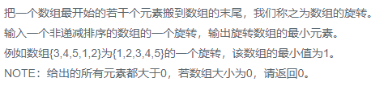

### 题目要求



### 解题思路

旋转数组的思路就是二分法找其旋转点也称为断点。如果一个有序数组经过旋转后，最小的值一定是数组中降序的那个位置，其余部分都是升序。同时，数组的第一个元素一定比最后一个元素大。如果没有经过旋转，数组整体都是升序，最小值就是数组的第一个值。所以在利用二分查找的时候，如果`arr[left] < arr[right]`，说明数组整体升序，直接返回`arr[left]`。否则，如果`arr[left] > arr[mid]`，说明降序一定发生在数组左半区，令`right = mid`；如果`arr[mid] > arr[right]`，说明降序一定发生在数组右半区，令`left = mid`。但是有一个很重要的问题，在arr数组中可能存在重复的值，那么就可能发生`arr[left] == arr[mid] == arr[right]`的情况。这个时候，我们从`left`位置开始，向右遍历，假设遍历到位置`i`，如果`arr[i] == arr[mid]`，继续向右遍历；如果`arr[i] > arr[mid]`，说明降序一定发生在`arr[i…mid]`之间，令`left = i，right = mid`；如果`arr[i] < arr[mid]`，说明此时出现了降序，直接返回`arr[i]`即可。如果遍历到`mid`位置都一直与`arr[mid]`相等，说明左半区都是一个值，所以降序一定出现在右半区，所以令`left = mid`。最坏的情况下，所有的值都是一个值。对于每个值都需要遍历一遍，所以最坏的时间复杂度是O(N)。

### 本题代码

```C++
class Solution {
public:
    int minNumberInRotateArray(vector<int> rotateArray) {
        // 程序员面试指南 P434
        //if(rotateArray.size() == 0) throw new std::exception("error");
        int low = 0;
        int height = rotateArray.size() - 1;
        while(low < height){
            if(low == height - 1){
                break;
            }
            if(rotateArray[low] < rotateArray[height]){
                return rotateArray[low];
            }
            int mid = low + (height - low) / 2;
            if(rotateArray[low] > rotateArray[mid]){
                height = mid;
                continue;
            }
            if(rotateArray[height] < rotateArray[mid]){
                low = mid;
                continue;
            }
            while(low < height){//说明三者相等
                if(rotateArray[low] == rotateArray[mid]){
                    low++;
                }
                else if(rotateArray[low] < rotateArray[mid]){
                    return rotateArray[low];
                }
                else{
                    height = mid;
                    break;
                }
            }
        }
        return std::min(rotateArray[low], rotateArray[height]);
    }
};
```

### [手撸测试](<https://www.nowcoder.com/practice/9f3231a991af4f55b95579b44b7a01ba?tpId=13&tqId=11159&tPage=1&rp=1&ru=/ta/coding-interviews&qru=/ta/coding-interviews/question-ranking>) 

