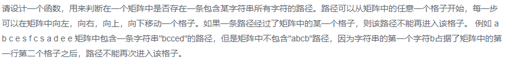

### 题目要求



### 解题思路

回溯法通吃。用一个动态表`falg`记录位置是否已被遍历过，变量`k`表示遍历字符串中第`k`个位置(如果等于字符串长度返回`true`)，变量`i`和`j`是从所给矩阵任意位置开始遍历(需要满足边界条件，并且`flag[i][j]`没有被遍历)。

### 本题代码

```c++
class Solution {
public:
    bool hasPath(char* matrix, int rows, int cols, char* str)
    {
        if(!matrix || !str)
            return false;
        int* flag = new int[rows * cols];
        for(int i = 0;i < rows * cols;i++){
            flag[i] = 0;
        }
        for(int i = 0;i < rows;i++){
            for(int j = 0;j < cols;j++){
                if(isPath(matrix, rows, cols, str, i, j, 0, flag)){
                    return true;
                }
            }
        }
        return false;
    }
    bool isPath(char* matrix, int rows, int cols, char* str, int i, int j, int k, int* flag){
        int index = i * cols + j;
        if(i < 0 || j < 0 || i >= rows || j >= cols || matrix[index] != str[k] || flag[index] == 1){
            return false;
        }
        if(k == strlen(str) - 1)
            return true;
        flag[index] = 1;
        if(isPath(matrix, rows, cols, str, i+1, j, k+1, flag) || isPath(matrix, rows, cols, str, i-1, j, k+1, flag) || isPath(matrix, rows, cols, str, i, j+1, k+1, flag) || isPath(matrix, rows, cols, str, i, j-1, k+1, flag))//上下左右四周遍历有一个为真就返回
            return true;
        flag[index] = 0;
        return false;
    }
};
```

### [手撸测试](<https://www.nowcoder.com/practice/c61c6999eecb4b8f88a98f66b273a3cc?tpId=13&tqId=11218&tPage=4&rp=1&ru=%2Fta%2Fcoding-interviews&qru=%2Fta%2Fcoding-interviews%2Fquestion-ranking>) 

